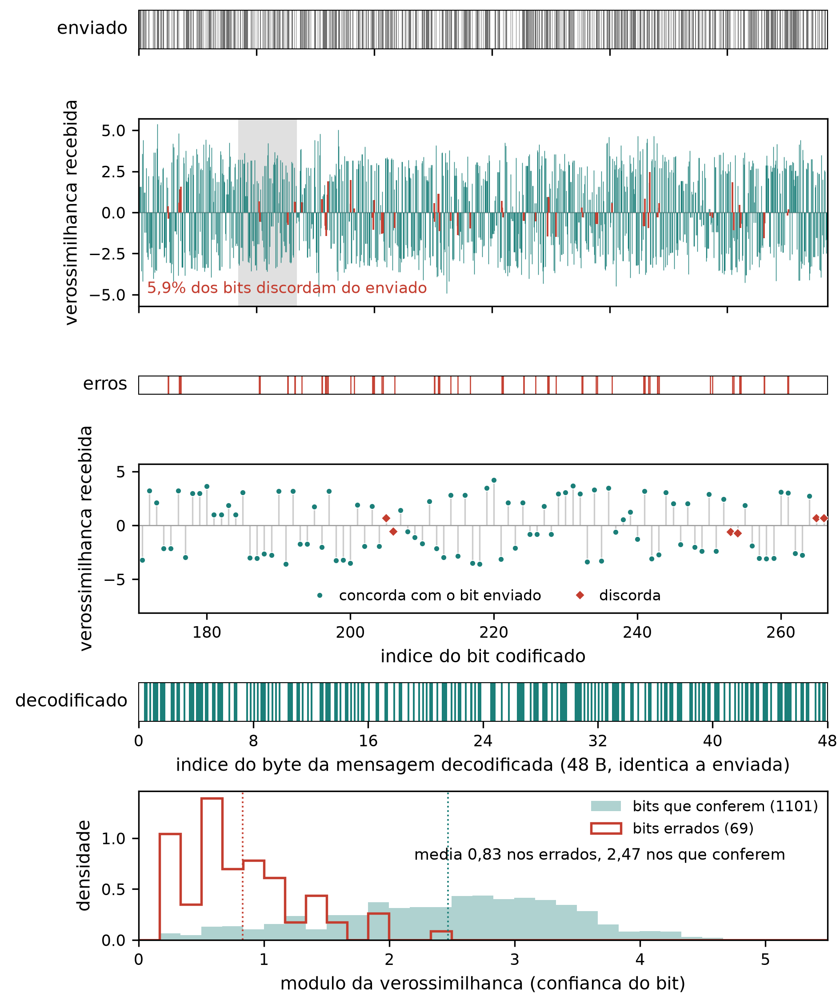

<!--
FONTE DO TEXTO. VII SIMECA / IFPR. Artigo do modem acustico.

Montagem: ./artigo/monta.sh  (gera artigo_modem.docx e artigo_modem.pdf; aceita --verifica, --sem-figuras)
Conversor: artigo/simeca-md. Correcao no conversor se faz la, nunca por copia.
Estilo: artigo/estilo.md. Ler antes de redigir qualquer secao.

ESTRUTURA (decisao do autor, 2026-09-06): 1 INTRODUCAO (uma lauda no maximo), 2 PRINCIPIO DE FUNCIONAMENTO,
  3 METODO DE MEDICAO, 4 RESULTADOS EXPERIMENTAIS, 5 CONSIDERACOES FINAIS. O modelo do evento sugere uma
  secao de fundamentacao teorica; e a forma de outro professor, nao regra de conteudo, e nao se segue. Nao ha
  secao de teoria: cada mecanismo traz a teoria minima que o sustenta, no ponto em que e usado. Objetividade
  antes de volume, em toda secao.
Secoes nao numeradas do modelo (AGRADECIMENTOS, FINANCIAMENTO, DECLARACAO DE IAG, CONFLITO, REFERENCIAS) ficam.
Extensao: 4 a 10 laudas. Resumo 150-300 palavras; 3 a 5 palavras-chave separadas por ponto final.
Legenda de figura ABAIXO do elemento; legenda de tabela ACIMA. Equacao centralizada e numerada a direita.
Citacao ABNT autor-data; "et al." em italico e sem ponto em "et".

Orcamento, em palavras de prosa (~750 por lauda; figura ou tabela 150-250):
  resumo 300 | introducao 450 | principio 900 | metodo 350 | resultados 750 | consideracoes 200
Contagem: wc -w artigo/artigo_modem.md  (inclui comentarios; descontar)

Convencoes: um paragrafo = uma linha; sem travessao na prosa; equacoes $...$ e $$...\tag{N}$$;
  figura como  seguida da linha "Figura N - legenda";
  "Tabela N - legenda" na linha antes da tabela em pipes; numeracao e conferida, nao gerada.
Nenhum numero entra sem origem em resultados/<pasta>.
CITACOES: nenhuma referencia foi inventada. "(CITAR: ...)" marca onde entra aglomerado e de que tipo.

ENQUADRAMENTO (decisao do autor, 2026-09-05): artigo didatico. Apresenta o sistema proposto, compara
brevemente com outros meios de transmissao, avalia o problema do canal acustico e propoe uma solucao para
este caso. Nao pretende substituir outro meio nem reivindicar melhoria sobre a literatura.

NOMENCLATURA (decisao do autor, 2026-09-05; fixa, nao muda mais):
  M-aria: modulacao de ordem M, em que cada simbolo e um tom escolhido entre M frequencias e carrega
    log2(M) bits. Abrange as quatro formas, inclusive a binaria (M = 2).
  FSK: modulacao por chaveamento na frequencia, do ingles *frequency shift keying* (FSK). Designa a 2-FSK.
  MFSK: chaveamento em multiplas frequencias, do ingles *multiple frequency shift keying* (MFSK). Designa
    as que usam mais de duas frequencias: 5x2-FSK (nas duas variantes) e 16-FSK.
  As quatro formas, sempre por esta notacao: 2-FSK; 5x2-FSK votada; 5x2-FSK multicanal; 16-FSK.
  Nunca: "20-FSK"; "M-ario" sem o M explicado; "MFSK" como nome de uma unica forma; nomes internos do
    codigo (mary, mfsk-par, fecrep) na prosa.
  Desvio em relacao ao codigo e ao CLAUDE.md da raiz: la "MFSK" e a de cinco pares e "M-ary" e a de
    dezesseis tons. No artigo nao. A correspondencia esta no CLAUDE.md da raiz.
  Forma de toda sigla estrangeira: nome em portugues, "do ingles", termo em italico, sigla entre
    parenteses depois do termo.

ESTADO DO TEXTO (2026-09-07, depois do merge das duas maquinas). O artigo esta sendo montado de tras
  para frente, comecando pelos RESULTADOS, com o que existe em ../resultados/. Cada figura mora na pasta da
  campanha que a gerou; artigo/figuras/ recebe copia para a montagem.
  SECOES 1 e 2: as desta maquina, reescritas em 2026-09-07 por decisao do autor, e mantidas no merge no
  lugar dos tocos "a redigir depois dos resultados" da versao remota. A 1 fala so de FSK, Bell 202, HART e
  transmissao por som, com quatro fontes lidas em PDF. A 2 tem 2.1, o meio, e 2.2, as quatro formas; a 2.3
  foi recolhida e o texto dela esta no comentario da 2.2.
  SECAO 4: a versao remota, redigida do fim para o comeco, com tres figuras que moram nas pastas 01, 02 e
  03 do sentido A2B.
  SECOES 3 e 5: como a versao remota as deixou, a redigir.
  As quatro contradicoes entre a 2.1 e a secao 5 foram fechadas em 2026-09-07, a pedido do autor e sempre
  mexendo na 1 e na 2: a secao 5 e a regua. O historico de cada uma esta no comentario da 2.1.
  ABERTO, depois da poda da secao 5 em 2026-09-07, que corrigiu de passagem os dois erros de fato que
  estavam listados aqui (os dez tons que sao cinco, e o 1,3 dB que era razao de 1,3). Restam dois pontos,
  os dois de estrutura:
  c) a secao 5 nao usa a notacao fixa. Ela diz "a primeira forma de transmissao medida" e "a segunda", e a
     "primeira" dela e' a SEGUNDA da 2.2, que apresenta as quatro em outra ordem. O leitor nao liga uma
     coisa a outra. A notacao esta fixada no CLAUDE.md desta pasta e a 2.2 a segue.
  d) a secao 5 se apoia na correcao de erros (os 48 bytes que chegam identicos sao o resultado dela) e a
     secao 2 nao a apresenta, porque a 2.3, "Sincronismo e correcao de erros", foi recolhida por decisao
     do autor "por enquanto". O texto dela esta preservado no comentario da 2.2. Voltar a 2.3 ou passar a
     apresentacao para a 3 e' decisao do autor.
  RENUMERACAO, 2026-09-07: a camada fisica virou a secao 3 e a camada de enlace a 4, entao os
  RESULTADOS passaram a ser a 5 e as consideracoes a 6. Este bloco ja fala na numeracao nova.
  O ponto (d) esta fechado: a correcao de erros passou a ser apresentada na secao 4, a camada de
  enlace, e nao volta para uma 2.3. O ponto (c) segue aberto e e' da secao 5.
-->

# Transmissão de dados por som audível entre dois computadores: o canal acústico medido e um modem para ele

<!--
Titulo: objeto + problema + solucao, tom didatico, sem promessa de melhoria. Maximo 3 linhas. Candidatos:
- Transmissão de dados por som audível entre dois computadores: o canal acústico medido e um modem para ele
- Um modem acústico com placa de som e microfone: da modulação binária ao M-ário com correção de erros
- Enlace de dados pelo ar audível: o que o canal faz com o sinal e o que se fez a respeito
-->

**AUTORES:**

<!--
nome | ORCID | filiacao | e-mail. Modelo exige ORCID de TODOS os autores, com o link correto.
Bloco COMPLETO em 2026-09-07: os dois autores com nome, ORCID, campus e e-mail. O ORCID do primeiro
autor foi conferido pelo digito verificador (ISO 7064 MOD 11-2) antes de entrar.
-->

1. Winderson Nascimento Da Cruz | 0009-0007-0636-7160 | IFPR, Campus Jacarezinho | windersoncruz00@gmail.com
2. Jefferson Wilhelm Meyer Soares | 0000-0003-3372-9298 | IFPR, Campus Jacarezinho | jefferson.soares@ifpr.edu.br

**DOI:** https://doi.org/10.5281/zenodo.XXX

## RESUMO

<!--
Redigido e aprovado em 2026-09-05; encurtado de 321 para 212 palavras em 2026-09-07. Ordem: o que apresenta; o problema, que e o meio; a solucao em duas
camadas; a implementacao e o metodo; os numeros. So a ultima frase tem numero.
Fonte dos numeros: resultados/14-FEC-REP, resultados/15-PKT-ARQ.
-->

Este artigo apresenta a transmissão de dados por som audível entre dois computadores, com alto-falante e microfone comuns, e o enlace exposto à aplicação como uma porta serial. O meio acústico impõe condições severas. Comporta poucas unidades de informação por segundo, aqui chamadas de símbolos, a amplitude que chega não é a que saiu, frequências vizinhas chegam com vários decibéis de diferença, o eco de um símbolo invade o seguinte, o ruído e a fala ocupam a mesma banda, e o hardware pode saturar e distorcer o sinal. Tratamos essas dificuldades em duas camadas. Na física, comparamos quatro modulações por chaveamento na frequência: a 2-FSK, do inglês *frequency shift keying* (FSK), a 5×2-FSK votada, com o mesmo bit em cinco canais e decisão por maioria, a 5×2-FSK multicanal, com cinco bits em paralelo, e a 16-FSK, com quatro bits por símbolo. Como ainda chegam bits errados, na camada de enlace implementamos correção antecipada de erros, sincronismo de quadro por palavra de referência, pacotes com verificação de redundância cíclica e retransmissão automática. Medimos cada recurso sobre gravações do mesmo enlace. Na melhor configuração o enlace entregou cerca de 11 bytes por segundo com 4 blocos íntegros em 4, e um arquivo de 1334 bytes chegou idêntico em 21 pacotes de 21, sem reenvio.

**PALAVRAS-CHAVE:** Modem acústico. Modulação por chaveamento de frequência. Codificação convolucional. Canal acústico.

## 1 INTRODUÇÃO

<!--
Refeita 2026-09-07. Escopo estreitado por decisao do autor: a introducao fala SO de FSK, Bell 202,
protocolo industrial HART e transmissao de dados por som. Saiu a comparacao entre cabo, radio,
infravermelho e som, e saiu com ela a Tabela 1, que existia so para aquela comparacao. Saiu tambem o
paragrafo de OFDM e chirp, que apresentava ferramentas do campo nao usadas aqui.
Cinco paragrafos: o que e FSK e o que o Bell 202 fixa; o Bell 202 vivo, no HART; o mesmo principio no
ar; o que o ar cobra; o que apresentamos.
Uma frase de cada artigo, e as quatro fontes foram LIDAS no PDF, nao no resumo:
  P1 FINNEGAN e BENSON (2014), p. 2: "The Bell 202 protocol is an audio frequency shift keyed (AFSK)
     modulation that encodes data by shifting between 1200Hz and 2200Hz audio tones. These tones
     represent a binary one and zero respectively and transitions occur at a rate of 1200 symbols per
     second. Originally developed by AT&T for use on the telephone network".
  P2 WU (2023), p. 2 e 4: "a backward-compatible enhancement to 4-20 mA instrumentation that allows
     two-way communication with smart, microprocessor-based field devices"; "The standard HART
     transmission is a frequency shift keyed (FSK) signal superimposed on the 4-20mA signal. The FSK
     bits are transmitted at 1200 bits per second"; a figura 1-3 marca 1200 Hz em "1" e 2200 Hz em "0",
     o que encerra a divergencia com as fontes secundarias que dizem 2400 Hz.
  P3 LOPES e AGUIAR (2001), p. 1: "Inter-machine communications have always been kept away from our
     own communication channel, audible sound in air. There are good reasons for this: the data rates
     are relatively low when compared to other media (e.g. electric wires, radio) and the sounds tend to
     be annoying. But as more and more devices support an audio channel for voice or music, that
     channel becomes a cheap option for transferring arbitrary information among devices that happen
     to be near each other."
  P4 PUTZ et al. (2026), p. 2: "sound waves travel more than 87 000 times slower than electromagnetic
     waves, leading to delay spreads on the order of tens of milliseconds"; e "Commercial products for
     acoustic data transmission on smart devices typically achieve only 10-200 bps"; a revisao e de 31
     estudos com mais de 11000 transmissoes.
P5 nao cita: e o que fizemos. Nenhum numero desta bancada entra aqui; ficam na secao 5.
NUMERACAO DE TABELA: a Tabela 1 saiu, entao a antiga Tabela 2 vira Tabela 1 e assim por diante. Nao
renumerei porque as secoes 3 a 5 estao em merge com a versao remota; renumerar depois do merge.
-->

A modulação por chaveamento na frequência, do inglês *frequency shift keying* (FSK), põe dados num canal de voz comutando a portadora entre duas frequências, uma para cada valor do bit. O padrão Bell 202 fixa essas duas frequências em 1200 e 2200 Hz, com transições a 1200 símbolos por segundo, e foi desenvolvido pela AT&T para a rede telefônica (FINNEGAN; BENSON, 2014). Um canal projetado para conduzir voz passa a conduzir bytes sem que nada no meio precise mudar.

O Bell 202 não é peça de museu. O protocolo de transdutor remoto endereçável em barramento, do inglês *Highway Addressable Remote Transducer* (HART), superpõe um sinal FSK de 1200 bits por segundo à malha de 4 a 20 mA que liga o transmissor de campo ao sistema de controle, sem perturbar o valor analógico que ela já carrega (WU, 2023). A retrocompatibilidade é o que o difundiu, pois o instrumento antigo filtra o sinal digital e continua medindo como antes.

O mesmo princípio vale no ar, e Lopes e Aguiar (2001) já observavam por que quase ninguém o usa assim. A comunicação entre máquinas sempre foi mantida longe do som audível por duas boas razões, a taxa baixa diante do fio e do rádio e o incômodo do som. A contrapartida é que o canal de áudio existe em cada aparelho, o que o torna uma opção barata de transferir informação entre dispositivos próximos, sem instalar nada.

O ar, porém, não é o par de fios. O som viaja mais de 87000 vezes mais devagar que a onda eletromagnética, de modo que as reflexões da sala se espalham por dezenas de milissegundos, e o multipercurso em ambiente fechado é a maior degradação dos esquemas acústicos publicados (PUTZ *et al.*, 2026). Na mesma revisão, de 31 estudos e mais de 11000 transmissões em aparelhos reais, os produtos comerciais entregam de 10 a 200 bits por segundo, que é a ordem de grandeza a esperar do meio.

Apresentamos um modem acústico que leva bytes de um computador a outro por som audível, com alto-falante e microfone comuns, e que se expõe à aplicação como uma porta serial. Partimos das duas frequências do Bell 202 e chegamos a dezesseis tons com correção de erros, e cada passo respondeu a um limite que medimos no ar. Verificamos o conjunto entre duas máquinas na mesma sala, transferindo um arquivo inteiro pelo ar.

## 2 PRINCÍPIO DE FUNCIONAMENTO

<!--
Redigida 2026-09-06. Mecanismo em palavras antes de qualquer equacao; a teoria minima de cada mecanismo
entra onde ele e usado. O canal primeiro, porque tudo o que segue e resposta a ele. Fronteira da fisica:
entrega simbolos e a verossimilhanca de cada bit; o enlace opera em bits, nunca em amostras.
-->

### 2.1 O meio acústico

<!-- Fonte: resultados/02-LVL-TONE e 02-LVL-TONE-A2B (tom pisado, unica frequencia medida assim),
03-CH-CHIRP-A2B (varredura), 12-13-SYNC.
CORRIGIDO 2026-09-07. O texto anterior dizia "medida tom a tom [...] a banda util vai de 550 a 3500 Hz" e
"acima de 4 kHz a SNR cai, 12 dB a 4000, 8 dB a 4500, zero a 5000, negativa acima de 6 kHz". Nada disso
tem origem em resultados/: o 02-LVL-TONE mede UMA frequencia, 1700 Hz, e os numeros de 4/4,5/5/6 kHz nao
aparecem em HEADER nenhum. A varredura A->B, repontuada em 2026-09-07 sobre a copia float32 local, mede o
contrario: 58,3 dB a 4012 Hz, 55,3 a 4462, 46,0 a 4988, e os melhores pontos de toda a varredura ficam
entre 4,1 e 4,4 kHz. O que cai com a frequencia e o NIVEL, nao a SNR, porque o piso cai mais rapido.
As duas varreduras discordam (A->B: 76 de 76 bins positivos; B->A: 74 de 76 negativos) e o proprio HEADER
do B->A explica: 4,0 s contra 6,0 s, pouca energia por Hz. Pela doutrina do projeto (medir uma frequencia
mandando aquela frequencia) nenhuma varredura decide SNR, e so o tom pisado decide, em 1700 Hz.
Numeros do pente recalculados a 50 Hz sobre a varredura A->B: degrau entre vizinhos com mediana 2,5 dB,
p90 6,5 dB, maximo 13,0 dB; excursao de 27,6 dB dentro de 550-3500 Hz; os 16 tons caem entre -5,7 e
-27,8 dB. O "13 a 18 dB" anterior valia como maximo e exagerava cinco vezes como faixa tipica.

AMPLIADA e depois ENCURTADA DUAS VEZES em 2026-09-07, a pedido do autor: 822 palavras, depois 649, agora
cerca de 495, contra 596 antes da ampliacao. Criterio: fica o que o leitor precisa para entender o canal,
sai o que so defende a metodologia, recapitula o que ja foi dito ou responde pergunta que ninguem fez.
O QUE FOI CORTADO, para nao ser reescrito por engano:
  - o paragrafo do ultrassom, com a banda de 22 kHz e os 4 kHz do modo inaudivel. Sobrou uma oracao, no
    paragrafo da SNR, porque a regra de estilo exige dizer o que ficou fora e com que razao. Com ele saiu
    a citacao de PUTZ et al. 7.3.3, sobre seletividade na banda quase-ultrassonica.
  - a discordancia entre as duas varreduras. E defesa de metodo, nao entendimento do meio; fica no
    comentario acima, que e onde ela importa.
  - os 30 dB SPL de dispersao entre modelos, de PUTZ et al. 7.3.2, de proposito: os demais decibeis desta
    secao sao amplitude de amostra em gravacao, medida relativa, e os 30 dB deles sao nivel de pressao
    sonora. Duas reguas na mesma unidade e no mesmo paragrafo confundiriam.
  - a condicao exata da interferencia ("o periodo cabe um numero inteiro de vezes na diferenca de
    percurso"). O leitor precisa saber que somam ou se cancelam conforme a frequencia; a condicao exata
    e verdadeira e nao muda nenhuma decisao do projeto.
  - as oracoes "porque..." das tres exigencias, que repetiam o que os paragrafos anteriores acabaram de
    dizer. A regra do autor manda cortar recapitulacao.
  - "cada uma das tres faltas cobra um preco diferente", da abertura, que e meta-discurso.
  - a FIGURA 1 INTEIRA, por decisao do autor em 2026-09-07: nada de imagem nesta secao. O numero que ela
    carregava sobreviveu na prosa, que e a excursao de 22 dB entre o tom mais forte e o mais fraco. Saiu
    com ela a unica imagem existente no artigo; as Figuras 2 a 5 nunca existiram como arquivo, e seguem
    citadas na prosa das secoes 2.2, 3 e 4, que nao foram alteradas aqui.
    O arquivo figuras/resposta-canal.png e o figura_canal.py que o gera ficaram sem uso. NAO foram
    apagados: a decisao de remove-los do repositorio e do autor, e o script ainda documenta como a
    varredura foi repontuada.
Tres citacoes sobreviveram, todas de PDF lido: LOPES e AGUIAR (2001) no pente, PUTZ et al. (2026) no eco
e no estouro. As frases exatas de origem estao em referencias.md.
O eco continua entrando como PROPRIEDADE DO MEIO e o paragrafo fecha pela negativa, dizendo que esta sala
nao tem cauda mensuravel. Nao virou dificuldade vencida, que os resultados desmentiriam.

=== CONTRADICOES COM A SECAO 4, FECHADAS EM 2026-09-07 ===
Decisao do autor: a secao 5 e a regua, e o acerto se faz na 1 e na 2. As quatro estao resolvidas; o que
cada uma dizia esta abaixo, para nao ser reescrito por engano.

1. A CAUDA. A 2.1 dizia "nesta bancada a cauda nao e mensuravel, o sinal para no piso de ruido". A secao 5
   mediu o contrario e a 2.1 cedeu: agora diz que o som nao cessa junto com a fonte e manda para a 4, que
   mede sem atribuir a origem. Vale saber o que a 4 mediu, porque nao e a banda de trabalho: em
   5600-6400 Hz, onde a rampa da varredura terminou, com janela de 512 amostras, cerca de 50 dB em meio
   segundo, chegando ao piso da sala por volta de 0,8 s (resultados/03-CH-CHIRP-A2B/figuras/COMO-REFAZER.md,
   item 3). O "no measurable reverberation" do CLAUDE.md da raiz veio de outra medida, sobre burst na banda
   de trabalho, e ganhou a ressalva la.
2. BANDA 550-3500 Hz. A 2.1 afirmava a banda e o nivel "12 a 20 dB" acima dela; os dois sairam. No lugar
   ficam os 700 a 3325 Hz que os tons de fato ocupam, que se conferem em modem.py e nao em varredura
   nenhuma. O ULTRASSOM FICOU, e de proposito: aquele paragrafo se apoia so em PUTZ et al. (2026) e na
   absorcao do ar, nao em medicao desta bancada, e a regra de estilo manda dizer o que ficou fora e por que.
3. EXCURSAO DE NIVEL. Os 28 dB da 2.1, em bins de 50 Hz, sairam. A excursao fica com a secao 5 e com a
   regua dela, 23,7 dB em passos de 74 Hz na faixa dos dezesseis tons. Duas reguas para a mesma ideia era
   o problema, e uma frase qualitativa na 2.1 com o numero na 4 resolve sem perder nada.
4. DEGRAU ENTRE VIZINHOS. Mesmo tratamento: sairam a mediana de 2,5 dB e o maximo de 13 dB (este ultimo
   nao se reconferia, procedencia.md mede 10,6 dB e mostra que o extremo depende de onde a analise comeca).
   A 2.1 diz que vizinhos chegam a diferir varios decibeis, a 4 da o "ate 9,4 dB".

A omissao tambem foi fechada: a 2.1 ganhou um paragrafo dizendo que o piso de ruido tem forma e mandando
para a 4, que mede a concentracao na metade inferior da banda. -->

Transmitir pelo ar é converter a sequência de amostras em variação de pressão, deixá-la atravessar a sala a 343 m/s e reconvertê-la em amostras do outro lado. Entre um conversor e outro estão o amplificador, o alto-falante, o ar, as superfícies que refletem e o microfone. Esse canal não é plano, não é linear e não é silencioso.

O ruído do ambiente ocupa a mesma banda, vindo do tráfego, de máquinas, da fala e do próprio manuseio dos aparelhos, em componentes tanto contínuos quanto em rajada (PUTZ *et al.*, 2026).

Esse ruído também não é plano ao longo da banda. Os resultados medem a forma dele nesta sala, concentrado na metade inferior, de modo que dois tons de frequências diferentes não disputam com o mesmo fundo.

Um alto-falante e um microfone de uso geral respondem bem na banda da fala e perdem eficiência nos extremos. Colocamos os tons entre 700 e 3325 Hz, dentro dessa região, e mesmo ali a resposta está longe de ser plana, como os resultados mostram.

O ultrassom fica fora deste trabalho. Exigir inaudibilidade reduz a banda a menos de 4 kHz, onde o hardware de áudio é seletivo (PUTZ *et al.*, 2026), e a absorção do ar cresce com a frequência e encurta o alcance.

Dentro da banda o sinal chega ao microfone pelo caminho direto e pelas reflexões nas superfícies da sala, cada uma atrasada pelo percurso que fez. Uma cópia atrasada reforça o som direto em certas frequências e o cancela em outras, conforme a diferença de percurso, e a resposta do canal é um pente de máximos e nulos que a geometria da sala fixa (KUTTRUFF, 2016).

Frequências separadas por algumas dezenas de hertz chegam assim a diferir vários decibéis, e a posição dos nulos muda quando alguém se move. Lopes e Aguiar (2001) já apontavam essas reflexões como a razão de não se confiar em muitos níveis de amplitude no ar.

As mesmas reflexões, vistas no tempo, são a reverberação, e enquanto a cauda dura a energia de um símbolo invade o seguinte. Em ambiente fechado o espalhamento chega a dezenas de milissegundos, absorvido por intervalo de guarda (PUTZ *et al.*, 2026). Nesta bancada o som também não cessa junto com a fonte, e os resultados medem o que sobra sem isolar a origem.

A cadeia analógica também não é linear. O cone do alto-falante tem excursão limitada e o amplificador, tensão limitada, então os picos são achatados quando o nível cresce, e o microfone comprime do mesmo modo na outra ponta. A energia retirada dos picos reaparece como harmônicos e intermodulação, parte deles dentro da própria banda de trabalho, onde nenhum filtro os separa do sinal. Passado esse ponto, subir o nível piora a recepção.

O estouro não é particularidade desta bancada. Putz *et al.* (2026) mediram distorção não linear na maioria dos aparelhos acima de cerca de 75% do volume máximo.

Disso decorrem duas exigências. A decisão do receptor não pode depender da amplitude absoluta de nenhum tom, e o nível de operação tem de ser encontrado por medição.

### 2.2 O sistema em duas camadas

<!--
NIVELADA 2026-09-07, decisao do autor, e esta e a doutrina desta subsecao: a secao 2 e a acustica e a
IDEIA GERAL, sem entrar no especifico, e a 2.2 e o unico lugar que integra o todo antes de o artigo se
partir em duas camadas. O especifico e das secoes 3 e 4. Titulo mudou de "As quatro formas de
transmissao" para "O sistema em duas camadas", porque a subsecao passa a apresentar tambem o enlace,
que antes nao aparecia em lugar nenhum da secao 2 depois que a 2.3 foi recolhida.
DESCEU PARA A SECAO 3, por ser mecanismo: o demodulador de atraso e produto da 2-FSK, a polaridade
alternada com as medias de 1620 e 1660 Hz, o criterio de presenca de 1,3, os 14 dB do acorde, os
dezesseis tons com o espacamento e o codigo Gray, a equacao (2) com o piso corrente, e o paragrafo do
relogio, da guarda e do preambulo. A equacao (2) MUDOU DE LUGAR e nao de numero, entao a numeracao das
equacoes segue 1 na 2.2, 2 e 3 na 3, e 4 na 4.
FICOU AQUI: a definicao de M-aria com a equacao (1), as quatro formas em uma frase cada, a tarefa do
detector com a citacao de LOPES e AGUIAR, a existencia da segunda camada e o que ela faz, e a fronteira
entre as duas, que e a verossimilhanca por bit.

A versao anterior desta subsecao foi REESCRITA em 2026-09-07, antes da nivelacao: descrever melhor o
nosso trabalho, como modulamos e como detectamos cada uma das quatro formas. Titulo novo; era "Modulacao", que nao dizia que a secao e sobre
as quatro formas que construimos. O termo "quatro formas de transmissao" e o vocabulario ja fixado no
CLAUDE.md desta pasta.
A 2.3, "Sincronismo e correcao de erros", foi RETIRADA por decisao do autor em 2026-09-07, "por
enquanto". O texto dela esta preservado no fim deste comentario, para voltar sem ser reescrito.

NUMEROS CONFERIDOS NO CODIGO EM 2026-09-07, nao no CLAUDE.md:
  2-FSK: MARK 1200 Hz, SPACE 2200 Hz, 1200 baud, 8N1; deteccao por atraso e produto, atraso de um
    quarto de periodo em 1700 Hz; fase continua entre simbolos.
  5x2-FSK: MFSK_PAIRS = (700,900) (1320,1120) (1540,1740) (2160,1960) (2380,2580), 200 Hz dentro de
    cada par, 100 baud. Polaridade alternada conferida par a par: nos pares 0, 2 e 4 o tom grave e o
    bit 0; nos pares 1 e 3 e o bit 1. Media dos acordes recalculada aqui: 8100/5 = 1620 Hz para o
    acorde do bit 0 e 8300/5 = 1660 Hz para o do bit 1, o que confirma o CLAUDE.md.
    MFSK_PRESENCE_MIN = 1.3.
  16-FSK: MARY_TONES, dezesseis tons de 888 a 3325 Hz; espacamento conferido, 162 Hz constante
    (1050-888 = 162, 3325-3162 = 163 por arredondamento). MARY_BITS = 4, codigo Gray, 100 baud.

CORRECAO, e ela vale para o CLAUDE.md da raiz tambem: O INTERVALO DE GUARDA E 15%, NAO 35%.
  O padrao entregue e guard=0.15 em MFSKDemodulator (linha 397) e MaryDemodulator (linha 796), e o
  descarte e no INICIO do simbolo, np.arange(self.guard, samples_per_symbol).
  Os 35% aparecem em dois lugares e nenhum e o caminho vivo: loopback_test.py linha 119, num caso
  deliberadamente ajustado para reverberacao ((0.35, 0.15, True)), e console.py linha 605, numa
  varredura de diagnostico que repontua audio guardado. O CLAUDE.md da raiz descrevia o caso de teste
  como se fosse o comportamento entregue, e a versao anterior desta secao repetia o erro; os dois
  CLAUDE.md foram corrigidos em 2026-09-07 e agora dizem 15%.

O marcador "(CITAR: modulacao M-FSK, deteccao nao coerente)" foi retirado: pela decisao de escopo do
autor, a literatura serve a introducao e a 2.1, e daqui para a frente o texto se sustenta no que
construimos e medimos. PROAKIS e SALEHI (2008) continua levantado em referencias.md, grupo G5, se o
autor quiser citar livro-texto para o principio M-ario.
A remissao "A Figura 2 mostra o espectro de cada uma" tambem saiu, porque nao ha figura no artigo.

TEXTO DA 2.3 RETIRADA, para restaurar quando o autor pedir:
  "O bloco e localizado por uma palavra de referencia de 31 bits, correlacionada sobre as LLR
  recebidas, nunca por contagem de simbolos, pois o gate consome numeros diferentes de amostras por
  simbolo enquanto ajusta. E a mesma correlacao que resolve o alinhamento de nibble da 16-FSK, em que
  um simbolo a mais antes do bloco troca os nibbles de todos os bytes. Acima do bloco, o arquivo vai
  em pacotes com numero de sequencia, comprimento e CRC-16, reenvio pare-e-espere dirigido pelo
  receptor, transmissor sem estado. A aplicacao ve uma porta serial virtual."
-->

Chamamos M-ária a modulação de ordem $M$, em que cada símbolo é um tom escolhido entre $M$ frequências e carrega $\log_2 M$ bits (PROAKIS; SALEHI, 2008), e a taxa de bits é o produto de (1).

$$R_b = R_s \log_2 M \tag{1}$$

Nela, $R_b$ é a taxa de bits, $R_s$ é a taxa de símbolos em bauds e $M$ é o número de frequências. Subir $M$ é o caminho para subir $R_b$, com a taxa de símbolos presa pela banda e pelas reflexões. Construímos quatro formas, e o que muda entre elas é quanto a decisão depende da amplitude. Elas ocupam as duas famílias que Lopes e Aguiar (2001) já haviam formulado, a de um tom por símbolo e a de $k$ tons simultâneos.

A 2-FSK usa os dois tons do padrão Bell 202, 1200 e 2200 Hz, e um bit por símbolo. A 5×2-FSK votada soa cinco pares de tons a cada símbolo, todos carregando o mesmo bit, e a maioria decide.

A 5×2-FSK multicanal usa os mesmos dez tons com um bit distinto em cada par, cinco bits por símbolo. A 16-FSK acende um tom entre dezesseis, quatro bits por símbolo.

A tarefa do detector é decidir quais frequências estão presentes, sem informação de fase, que é a detecção não coerente (PROAKIS; SALEHI, 2008; LOPES; AGUIAR, 2001). Nas três formas de mais de dois tons ele não compara com um limiar, e sim uma frequência com outra, e é isso que torna a decisão indiferente à amplitude com que o som chegou.

Nenhuma dessas formas entrega todos os bits certos sobre este canal, e por isso o sistema tem uma segunda camada. Os dados vão em blocos de tamanho fixo protegidos por um código convolucional, decodificado pelo algoritmo de Viterbi (VITERBI, 1967), e cada bloco é localizado no fluxo por uma palavra de referência.

Acima do bloco o arquivo é partido em pacotes com soma de verificação, pedidos um a um pelo receptor e reenviados enquanto a soma não fechar, que é o arranjo pare-e-espere dos protocolos de enlace (TANENBAUM; WETHERALL, 2011).

A camada física entrega ao enlace a verossimilhança de cada bit, e não o bit, de modo que o corretor recebe também a confiança de cada decisão. Acima das duas a aplicação vê uma porta serial virtual.

## 3 CAMADA FÍSICA

<!--
Redigida 2026-09-07. A secao 3 era "METODO DE MEDICAO", esqueleto vazio, e foi substituida. A numeracao
do modelo do evento foi dispensada por decisao do autor nesta data: fisica em 3, enlace em 4, resultados
em 5, consideracoes em 6. As remissoes "a secao 4 mede" da 2.1 foram renumeradas para 5.
Escopo: o principio de funcionamento e a razao de cada escolha. NENHUM resultado desta bancada entra
aqui; onde o mecanismo existe por causa de uma medida, o texto remete a secao 5 sem dar o numero.
Todos os numeros foram conferidos em modem.py, nao no CLAUDE.md: tons, bauds, ordem e faixa dos filtros,
atraso de sete amostras, divisao da amplitude por cinco, 72 amostras de 480, tres janelas candidatas com
delta de um oitavo e passo de correcao de um trinta e dois avos.
DUPLICACAO COM A 2.2: a 2.2 descreve as quatro formas em cerca de 500 palavras e esta secao redescreve o
mecanismo. O corte na 2.2 e decisao do autor e esta anotado na resposta da sessao; nada da 2.2 foi
alterado aqui. As varreduras de sincronismo NAO entram nesta secao, para nao duplicar a 4, que as trata
inteiras.
GRAY, ponto aberto: o mapeamento implementado atribui ao valor v o tom de indice g(v) = v xor (v>>1),
o que NAO garante um bit de diferenca entre tons vizinhos. Conferido: dos quinze pares de tons vizinhos,
doze diferem em um bit e tres diferem em dois (os pares de indice 3-4, 7-8 e 11-12). A afirmacao da 2.2,
"para que a confusao do canal custe um bit e nao quatro", precisa virar "custe um bit na maioria das
confusoes". Esta secao nao repete a afirmacao.
-->

A 2-FSK usa os dois tons do padrão Bell 202 a 1200 símbolos por segundo, sai do modulador com fase contínua e leva cada byte em 8N1.

A detecção é por atraso e produto: um passa-faixa Butterworth de quarta ordem entre 800 e 2600 Hz limpa o sinal, multiplicado por uma cópia de si mesmo atrasada de sete amostras, um quarto de período em 1700 Hz, e um passa-baixa em 1800 Hz filtra o produto, positivo para um tom e negativo para o outro. A decisão é o seu sinal, e a fraqueza está aí: um canal que atenue um tom mais que o outro enviesa todas elas no mesmo sentido.

A 5×2-FSK votada compara dentro de cada par, a 100 símbolos por segundo, com 200 Hz entre os dois tons, pouco o bastante para que o canal os trate quase igual. Como uma razão entre dois ruídos ainda elege um vencedor, a mediana das cinco razões abaixo de 1,3 rejeita o símbolo.

Os dez tons foram escolhidos contra harmônicos cruzados: nenhum harmônico de um acorde cai sobre um tom do outro.

Nas duas formas de cinco pares o modulador divide a amplitude por cinco, e cada tom parte 14 dB abaixo do que partiria sozinho.

A 16-FSK devolve essa potência com um tom por vez: dezesseis tons de 888 a 3325 Hz, espaçados 162 Hz, quatro bits por símbolo e os valores em código Gray. O receptor mede a energia de cada tom, divide pelo piso corrente daquela frequência e elege o maior, conforme (2).

$$\hat{s} = \arg\max_k \frac{E_k}{P_k} \tag{2}$$

Nela, $E_k$ é a energia no tom $k$ e $P_k$ é a média corrente dessa energia, com fator 0,02 e sem o tom de maior energia do símbolo. Como cada tom fica em silêncio quinze símbolos em dezesseis, essa média é o piso de ruído naquela frequência.

O relógio das três formas de 100 bauds vem de uma malha de adiantamento e atraso: a cada símbolo o receptor pontua três janelas deslocadas de um oitavo de símbolo, e corrige o instante do seguinte em um trinta e dois avos.

As primeiras 72 amostras de 480 são descartadas como guarda, 15% do símbolo, e a decisão se faz sobre as 408 restantes, onde a cauda do símbolo anterior já não está.

O preâmbulo é alternado, porque a malha trava em transições, e a rajada fecha com cauda ociosa, sem a qual o último byte fica preso.

Na 16-FSK a saída é a verossimilhança logarítmica de cada bit do símbolo, do inglês *log-likelihood ratio* (LLR), dada por (3).

$$\Lambda_j = \max_{b_j(v)=1} \ln \frac{E_{g(v)}}{P_{g(v)}} - \max_{b_j(v)=0} \ln \frac{E_{g(v)}}{P_{g(v)}} \tag{3}$$

Nela, $v$ percorre os dezesseis valores de quatro bits, $b_j(v)$ é o bit $j$ de $v$, $g(v)$ é o tom que o código Gray atribui a $v$, e $E$ e $P$ são os de (2).

Esse fluxo sobe sem enquadramento, e começar um símbolo antes ou depois troca os quatro bits altos de cada byte pelos baixos. Quem resolve isso é a camada de enlace.

## 4 CAMADA DE ENLACE

<!--
Redigida 2026-09-07, junto com a 3. Mesmo escopo: mecanismo e razao, nenhum resultado desta bancada.
Conferido no codigo, nao no CLAUDE.md: polinomios 171, 133 e 165 em octal e comprimento de restricao 7
(fec.py), seis bits de cauda, entrelacador por transposicao com profundidade 16 APLICADO DEPOIS da
repeticao, palavra de 31 bits NAO CODIFICADA a frente do bloco (fec.frame), mapa da copia r do bit i no
par (i+r) modulo o numero de pares (fec.pair_map), varreduras de 700 a 3400 Hz em 0,08 s com 30 ms de
silencio de cada lado (console.SYNC_HUSH = 0.03) e periodo aceito entre 0,98 e 1,02 do nominal
(console._sweep_llr), entrada de doze bytes 0x55, byte de sincronismo, sequencia, comprimento, carga e
CRC-16 CCITT-FALSE, embaralhamento chaveado pela posicao (xfer.py), ate quatro tentativas e preenchimento
com zeros (recvfile.py).
FEC, CRC e ARQ sao apresentados por extenso aqui porque, no corpo do artigo, e a primeira ocorrencia de
cada um; o resumo os apresenta a parte, como o modelo do evento pede.
-->

O canal entrega uma fração dos bits errada, e pedir de novo só converge quando a chance de o bloco chegar limpo já é alta. Os bits têm de ser reparáveis onde caem.

Dentro do bloco não há enquadramento 8N1, em que um bit de partida corrompido desloca todos os bytes seguintes: o bloco de tamanho fixo não tem o que deslocar.

A correção antecipada de erros, do inglês *forward error correction* (FEC), é um código convolucional de comprimento de restrição 7, com polinômios geradores 171, 133 e 165 em octal, três bits codificados por bit de entrada. Seis bits de cauda o fecham no estado zero, de onde o decodificador parte.

O decodificador é um Viterbi de decisão suave: cada bit chega como uma verossimilhança logarítmica e a métrica de cada ramo da treliça é a soma em (4).

$$\mu = \sum_{j=1}^{n} (2c_j - 1) L_j \tag{4}$$

Nela, $c_j$ é o $j$-ésimo bit que o ramo emitiria, $L_j$ é a verossimilhança recebida na mesma posição e $n$ é o número de bits codificados por passo. Um bit duvidoso quase não move $\mu$, e o percurso segue os bits de que o receptor está seguro.

A redundância por repetição replica o bloco e o decodificador soma as cópias, pois observações independentes do mesmo bit se somam. Os dois lados têm de concordar nela: a divergência é indetectável e se lê como canal ruim.

Um entrelaçador por transposição de matriz, com profundidade 16, vem depois da repetição e não antes, para que as cópias de um bit caiam distantes no tempo e uma perturbação concentrada chegue como erros isolados.

Na 5×2-FSK multicanal a cópia $r$ do bit $i$ vai para o par $(i+r)$ módulo o número de pares, pois ladrilhar o bloco poria todas as cópias no mesmo par, derrubadas juntas por um nulo do pente.

O bloco é localizado por uma palavra de referência de 31 bits, que viaja sem codificação à frente dele, achada por correlação sobre as verossimilhanças, nunca por contagem de símbolos, que escorrega enquanto o relógio ajusta. É a mesma correlação que resolve o alinhamento de símbolo da 16-FSK.

Duas varreduras de tom de 80 ms podem cercar o quadro e dar, por filtro casado, o instante em que ele começa e o período de símbolo medido, recurso que vem desligado porque exige os dois lados de acordo.

Acima do bloco corrigido, o arquivo vai em pacotes de doze bytes de guia, um byte de sincronismo, número de sequência, comprimento, carga de até 255 bytes e dois bytes de verificação de redundância cíclica, do inglês *cyclic redundancy check* (CRC).

O corpo e o CRC são embaralhados por um gerador pseudoaleatório de semente fixa, chaveado pela posição, o que desfaz padrões repetidos que privariam o relógio de transições.

A retransmissão automática, do inglês *automatic repeat request* (ARQ), é pare-e-espere dirigida pelo receptor, que pede um pacote por vez e descarta o áudio capturado antes de o pedido sair. São até quatro tentativas por pacote, o que não chega vira zeros, que preservam o deslocamento dos bytes seguintes, e um CRC de 32 bits sobre o arquivo decide se ele vale.

Acima disso a aplicação vê uma porta serial virtual, sem detecção de erro nenhuma: o modem é a linha burra que o ecossistema serial espera, e quem corrige está abaixo dela.

## 5 RESULTADOS EXPERIMENTAIS

<!--
Redigido a partir de 2026-09-07, do fim para o comeco. Campanhas escolhidas com o autor: 01, 02 e 03 para o
canal; 04, 05, 06 e 07 para as quatro formas; 07 para linearidade; 08 para ganho; 11 para potencia; 12-13
para deriva de relogio e quadro longo; 14 para redundancia; 15 para arquivo; 08-A2B, 16 e 17 para as duas
direcoes. Podada em 2026-09-07 a pedido do autor, lendo a secao por si so, em duas passagens: 2164 para 1668 e daí
para 1536 palavras. Saiu justificativa de metodo, comentario sobre o proprio texto, mecanismo generico onde
havia medida, e a repeticao entre paragrafo e legenda, que na segunda passagem foi o grosso: a legenda
passa a dar a chave de leitura da figura e o numero fica no paragrafo, uma vez so. Ficaram todos os numeros
e todas as figuras, conferidos um a um nas duas passagens. Dois erros de fato foram corrigidos na mesma passagem, os dois
conferidos em modem.py e nao contra outra secao: soam CINCO tons por simbolo e nao dez (`out / len(tones)`
em MFSKModulator._symbol divide por cinco), e saiu o "precisa de apenas 1,3 dB", que era MFSK_PRESENCE_MIN,
razao de energia de 1,3 (ou seja 1,1 dB) e criterio de outra camada que nao a da Figura 2.
Nenhum numero entra sem pasta. Ficaram de fora, por falta de lastro: banda util 550-3500 Hz, colapso acima
de 4 kHz e o descarte do ultrassom, todos herdados de uma medicao tom a tom que nunca virou pasta.

REVISAO DE 2026-09-07, sobre o artigo inteiro, registrada em REVISAO-2026-09-07.md. O que mudou aqui, e o
que cada correcao reconferiu:
  ABERTURA. A secao passa a dizer o SENTIDO do enlace, que muda no meio dela: Figuras 1 a 3 sao A->B
    (pastas 01, 02 e 03 do sentido A2B, microfone de B), todo o resto e B->A (05, 07, 08, 14, 15). Sem
    isso a secao atribuia a Figura 1, que e o piso de B, a gravacoes feitas no microfone de A. Entra
    tambem, no mesmo lugar, a frase do cabo serial que o CLAUDE.md exige, e a declaracao de que as
    Figuras 4 a 9 foram gravadas com o bloco repetido duas vezes, condicao que faltava.
    NAO foi escrita secao de bancada, por decisao do autor de 2026-09-07: nao se fala de bancada.
  25 dB -> 15 dB na queda entre 2000 e 2900 Hz. Recalculado sobre 01-LVL-BASE-A2B: 14,6 dB na curva media,
    que e a serie desenhada; os 25 dB nao vinham de regua nenhuma.
  50 dB -> 36 dB na cauda da varredura, com o piso alcancado por volta de 0,8 s. Numeros do
    03-CH-CHIRP-A2B/figuras/COMO-REFAZER.md: -29,9 dBFS em +0,00 s, -66,1 em +0,50 s, -82,1 em +0,80 s.
  Os 13,0 dB da Figura 2 ganharam a ressalva que a pasta 02-LVL-TONE-A2B manda dar: e a saia do proprio
    tom na janela de 408 amostras, nao margem contra outro tom transmitido.
  Harmonicos: 30,5 e 42,2 dB passam a ser ditos como MEDIANA ao longo da varredura, que e o que sao.
  SAIU a frase dos decibeis por par (8,6 a 9,0 / 6,6 / 2,7 dB): nao existe em pasta nenhuma. O
    05-MFSK-VOTE imprime acerto de voto por par, nao separacao em dB ao longo do bloco. Com ela saiu a
    atribuicao ao piso da Figura 1, que era de outro sentido do enlace.
  Os 6,9 dB do piso interno da 16-FSK perderam a comparacao com a Figura 1: um e divisor do detector em
    B->A, outro e espectro de sala em A->B.
  87,7% e 88,1% passam a ser ditos como grandezas diferentes, maioria dura contra soma suave
    (05-MFSK-VOTE/figuras/COMO-REFAZER.md).
  A 5x2-FSK entregou o bloco em UMA gravacao de tres, e o artigo dizia so que entregou. A 16-FSK entregou
    nas tres validas, e as seis anteriores foram descartadas por saturacao (07-MARY-BASE/resultado.csv,
    valido=nao nas seis primeiras).
  A faixa unica "entre 85% e 94%" reunia duas cadeias eletroacusticas incomparaveis, ressalva que o
    HEADER do 05-MFSK-VOTE manda dar. Agora cada forma da a sua faixa e o texto diz que nao se comparam.
  As 420 a 585 amostras nao sao o passo do relogio: o passo e 480 mais ou menos 15 (`samples_per_symbol
    + adjust` em modem.py), e 420 a 585 e o espacamento entre JANELAS DE DECISAO. Corrigido; o erro
    contradizia a secao 3, que descreve o mecanismo certo.
  ENTROU o paragrafo do ganho, da campanha 08-MARY-GAIN, que fecha a remissao da secao 3 sobre nivel de
    operacao: numa cadeia linear o ganho de 1,00 a 0,25 nao move a recuperacao, 96% a 98% dos bits nas
    doze gravacoes, e o mesmo corte na cadeia saturada da 07 e o que separou 1 de 3 de 3 de 3.
  SAIU o paragrafo do codigo convolucional, que repetia inteira a secao 4, e a recapitulacao "detectar
    nao bastaria", que repete a abertura da 4.
  ENTROU a frase que diz que a 2-FSK e a 5x2-FSK multicanal ficaram fora deste recorte, com a razao.
  Notacao fixa: "a primeira forma medida" e "a segunda" viraram 5x2-FSK votada e 16-FSK.
-->

Os ensaios usam duas máquinas na mesma sala, cada uma com alto-falante e microfone próprios. Um cabo serial entre elas automatiza o ensaio e não conduz dado da medida: a carga é gerada dos dois lados a partir de uma semente combinada por ele, e os bytes pontuados viajaram só pelo ar. As gravações das Figuras 4 a 9 usaram o bloco codificado repetido duas vezes.

A Figura 1 mostra o ruído da sala com o enlace parado, média de quatro gravações de oito segundos em janelas de 50 Hz. O piso não é plano: concentra-se abaixo de 2 kHz e varia 27 dB sob os dezesseis tons da 16-FSK, de −67,6 a −94,8 dBFS. Comparar níveis absolutos entre tons leria essa diferença como sinal, e por isso cada tom é medido contra o próprio piso.

Figura 1 - Piso de ruído do microfone receptor com o enlace parado, média de quatro gravações de 8 s em janelas de 50 Hz. A faixa cinza são os extremos entre as gravações e as marcas no rodapé são os dezesseis tons da 16-FSK.

A Figura 2 mostra o que o detector da 16-FSK mede enquanto a máquina transmissora emite um tom de 1700 Hz, o sexto dos dezesseis. O tom chega 47,4 dB acima das sondas que não receberam nada e 13,0 dB acima da segunda mais alta, que é a saia do próprio tom espalhada pela janela de 408 amostras. Um seno sintético analisado na mesma janela, sem transdutor e sem sala, reproduz esse alargamento, então ele é da medida e não do canal.

Figura 2 - Nível nas dezesseis sondas do detector da 16-FSK com um tom de 1700 Hz transmitido, comparado com a sala parada e com um seno sintético analisado na mesma janela. O seno não passou por transdutor nem por sala, então o alargamento em torno do pico é da janela de análise.

A Figura 3 mostra uma varredura de 300 a 6000 Hz gravada em seis segundos, e nela o alargamento reaparece como duas diagonais. São o segundo e o terceiro harmônico, em mediana 30,5 e 42,2 dB abaixo da fundamental, frequências que ninguém transmitiu e que dentro da banda de trabalho são indistinguíveis de sinal.

Figura 3 - Espectrograma de uma varredura de 300 a 6000 Hz gravada pelo microfone receptor, com janela de 4096 amostras (11,7 Hz por bin). As duas diagonais acima da varredura são o segundo e o terceiro harmônico, e os riscos verticais em 3,6 s e entre 4,2 e 4,4 s são sons da sala.

Essas sombras posicionam os tons. Os dezesseis ocupam de 888 a 3325 Hz espaçados de 162 Hz, quase uma oitava e meia, então o segundo harmônico de seis deles cai a menos de 76 Hz de outro tom e o terceiro de dois deles a menos de 12 Hz. A sombra fica 30,5 dB abaixo da fundamental contra os 47,4 dB de margem do tom transmitido, e consome margem sem decidir o símbolo.

O nível ao longo da faixa também não é uniforme. Medido pela mesma varredura em passos de 74 Hz, varia 23,7 dB entre o melhor e o pior ponto, com até 9,4 dB entre pontos vizinhos.

Depois que a varredura acaba o nível cai cerca de 36 dB ao longo de meio segundo e alcança o piso da sala por volta de 0,8 s. O desligamento do transmissor leva 10 ms, então a cauda não é dele, e uma gravação só não separa a sala do alto-falante sem fio. É contra essa cauda que existe o intervalo de guarda descartado no início de cada símbolo.

A 5×2-FSK votada reparte a decisão entre cinco pares de tons. Cinco frequências soam a cada símbolo, uma por par, cada par decide pelo tom que chegou mais forte, e a maioria dos cinco dá o bit. São cem símbolos por segundo, um bit por símbolo, com os primeiros 15% de cada símbolo descartados como guarda.

A polaridade alterna ao longo da banda. Nos pares de 700, 1540 e 2380 Hz o tom mais grave significa 0, e nos de 1120 e 1960 Hz significa 1, então os dois acordes ficam entrelaçados e com quase a mesma frequência média.

As Figuras 4 a 6 são da mesma transmissão. Na abertura os bits se alternam e os dois acordes se revezam a cada dez milissegundos. Em dois símbolos da carga aparece a energia nas dez frequências, e quem decide é a comparação dentro de cada par, nunca o nível absoluto. Em trinta símbolos consecutivos todos os bits saem certos, e em vinte e dois deles ao menos um par votou contra os demais.

Figura 4 - Trecho alternado que abre a transmissão, com a leitura do receptor sobre o espectrograma. Cada coluna é um símbolo e cada marcador é o tom que venceu o seu par, com a forma dizendo que bit ele significa.

Figura 5 - Espectro na janela de decisão de dois símbolos, um com bit 0 e outro com bit 1, com as barras nas dez frequências que o detector compara.

Figura 6 - Trinta símbolos consecutivos da carga. Os marcadores em vermelho são os pares que votaram contra o bit transmitido.

Cada par isolado acerta de 74,0% a 86,1% dos bits. Reunidos pela maioria chegam a 87,7%, e a decisão suave, que conserva a confiança que o voto descarta, leva a 88,1% dos 2340 bits do bloco. Com a correção de erros os 48 bytes chegaram idênticos.

A 16-FSK troca a redundância por densidade. Dezesseis frequências entre 888 e 3325 Hz se revezam, exatamente uma soando por vez, e qual delas soou nomeia quatro bits, à mesma taxa de cem símbolos por segundo. Frequências vizinhas recebem códigos que diferem em um único bit em doze dos quinze pares, porque são as que o canal confunde.

Com um tom por vez toda a potência que o alto-falante aceita vai para ele, onde cinco tons simultâneos dividem o mesmo pico. A decisão é escolher o maior entre dezesseis, cada tom contado do próprio piso corrente.

As Figuras 7 a 9 mostram trinta símbolos da carga, a decisão em um deles e o enquadramento do mesmo trecho. O tom transmitido fica 8,0 dB acima do segundo colocado, contra uma mediana de 7,9 dB ao longo do bloco. As duas máquinas não compartilham relógio, e o receptor corrige o passo em quinze amostras das 480 nominais a cada símbolo.

Figura 7 - Trinta símbolos consecutivos da carga, com o tom detectado marcado sobre cada um entre os dezesseis do eixo. Neste trecho o detectado é o transmitido nos trinta.

Figura 8 - Decisão em um símbolo. Em cima, o espectro na janela de decisão e o piso corrente de cada tom. Embaixo, a energia de cada tom contada do próprio piso, que é a grandeza comparada.

Figura 9 - O mesmo trecho, com as fronteiras de símbolo que o receptor usou e a grade de passo nominal. Acima do quadro, os quatro bits enviados em cada símbolo, já codificados e entrelaçados.

Nas três gravações válidas os 48 bytes chegaram íntegros. Antes da correção de erros o tom detectado coincidiu com o transmitido em 72,5% a 89,5% dos símbolos, e 85,2% a 94,5% dos bits chegaram certos.

Com a cadeia analógica linear o nível deixa de ser alavanca. Variar o ganho do transmissor de 1,00 a 0,25 não moveu a recuperação, e as doze gravações leram de 96% a 98% dos bits. O mesmo corte de nível, na cadeia saturada, separou uma gravação íntegra de três de todas as três.

Para cada bit da mensagem o transmissor emite três, calculados a partir dele e dos seis anteriores. O receptor não decide bit a bit: entre as sequências que o codificador poderia ter produzido, escolhe a mais provável diante do que chegou, pesando cada bit pela confiança com que o demodulador o entregou.

A Figura 10 mostra isso sobre 48 bytes, que ocupam 1170 bits no ar. Sessenta e nove chegaram trocados, 5,9%, e a mensagem saiu idêntica. Os errados chegaram com pouca confiança, módulo médio de 0,83 contra 2,47 nos que conferem, e é dessa diferença que o decodificador vive.

Figura 10 - Correção de erros sobre 48 bytes. No recorte, cada bit codificado com o sinal dando o bit decidido e a altura dando a confiança; os losangos são os que chegaram trocados, quase todos rentes ao zero.

Repetir o bloco codificado não comprou nada nesta sala. Nas doze gravações, quatro por ponto, uma, duas e quatro repetições entregaram todos os blocos íntegros com o mesmo acerto de bits, e a taxa útil caiu de 11,3 para 3,7 bytes por segundo. O canal operou entre 5,9% e 9,6% de bits codificados errados, e a taxa um terço com decisão suave tolera 10% em simulação, então a margem já bastava. A repetição levaria esse limite a 19%, numa sala pior que esta.

A decisão suave é o que rende, e sai de graça, porque a verossimilhança é um número que o demodulador já calculou: na mesma taxa de código ela leva a tolerância simulada de menos de 2% para 5%.

Um bloco corrigido não é ainda um arquivo. Os dados são partidos em pacotes com número de sequência, comprimento e verificação de redundância cíclica, e o receptor pede um pacote, confere, e só então pede o seguinte, repetindo enquanto a verificação falhar. Uma imagem de 1334 bytes chegou idêntica ao enviado em duas corridas, vinte e um pacotes de 64 bytes a 6,8 bytes por segundo sem nenhuma retransmissão, e onze pacotes de 128 bytes a 7,2 bytes por segundo com três. A taxa fica abaixo dos 11,3 do bloco por causa do preâmbulo de cada pacote, do cabeçalho, da verificação e do intervalo entre confirmar um pacote e pedir o próximo.

## 6 CONSIDERAÇÕES FINAIS

<!--
Redigida 2026-09-07, dois paragrafos por decisao do autor. O primeiro e o que foi feito e o que ele
entrega, o segundo e o que limita esses numeros e o que ficou por medir.
Nenhum numero novo: todos vem da secao 5. Os 5,9% a 9,6% e o limite de 10% sao a ponte entre as
Tabelas 1 e 2; os 11,3 B/s com quatro blocos de quatro sao a primeira linha da Tabela 1; o arquivo de
1334 bytes e a Tabela 3; a linearizacao da cadeia e o paragrafo do ganho, da campanha 08.
A frase sobre o que fica para a versao final esta no fim, como o comentario anterior pedia: refazer a
2-FSK na cadeia atual, item 4 de "O que falta medir" no HANDOFF.md, e medir o reenvio com mais de uma
corrida por condicao, que a propria secao 5 declara como limite da Tabela 3.
-->

Construímos um modem acústico que leva bytes de um computador a outro por som audível, com alto-falante e microfone comuns, e o expusemos à aplicação como uma porta serial. A camada física entrega a verossimilhança de cada bit e a de enlace repara o que o ar estraga, e é essa divisão que faz o enlace funcionar: das dezesseis frequências chegam entre 5,9% e 9,6% dos bits codificados trocados, e o código absorve até 10%. Dentro dessa margem o enlace entregou 11,3 bytes por segundo com todos os blocos íntegros, e um arquivo de 1334 bytes chegou byte a byte idêntico.

Esses números valem para uma sala e duas máquinas, e só depois de a cadeia analógica ser linearizada, o que faz do nível de operação um parâmetro a medir em cada instalação e não uma constante do projeto. Das quatro formas de transmissão construídas, duas foram medidas nessa cadeia, e refazer a 2-FSK nela fica para a versão final. Fica também medir o reenvio com mais de uma corrida por condição, que aqui mostra a falha por pacote baixa sem chegar a medi-la.

## DECLARAÇÃO DE USO DE INTELIGÊNCIA ARTIFICIAL GENERATIVA

Em conformidade com a Portaria CNPq nº 2.664/2026, os autores declaram o uso de Claude-Code (Anthropic) e Codex (OpenAI) na concepção, para discussão da abordagem e levantamento de referências, na implementação e na análise, para redação e depuração do firmware e dos scripts de ensaio, e na redação do texto, para clareza e correção de linguagem. Todo o conteúdo gerado foi verificado e editado pelos autores, que assumem responsabilidade integral pelo trabalho.

## CONFLITO DE INTERESSES

Os autores declaram não haver conflito de interesses no desenvolvimento e na publicação deste trabalho.

## REFERÊNCIAS

<!--
ABNT autor-data, ordem alfabetica, uma referencia por linha. Nenhuma foi inventada; os marcadores
"(CITAR: ...)" no corpo dizem que aglomerado entra em cada ponto. Grupos necessarios:
- comunicacao acustica entre dispositivos, transferencia de dados por audio (1, P1)
- Bell 202, modems telefonicos, discriminador de frequencia (1, P2)
- canal acustico em ambiente fechado, resposta impulsiva de sala, resposta em pente (1 P3; 2.3)
- OFDM acustico, chirp acustico, MFSK acustico, estimativa de canal (1, P4)
- modulacao M-FSK, deteccao nao coerente, diversidade em frequencia (2.2)
- reverberacao, tempo de reverberacao, interferencia entre simbolos (2.3)
- CRC, ARQ, pare-e-espere, HDLC (2.4)
- codigos convolucionais, Viterbi, decisao suave, entrelacamento, codigos de repeticao (2.4)

PREENCHIDA em 2026-09-07, com quatro fontes, e AMPLIADA para oito no mesmo dia. As quatro que entraram
depois sustentam conceito de terceiros que o artigo usava sem creditar: KUTTRUFF no filtro pente da 2.1,
PROAKIS e SALEHI no principio M-ario e na deteccao nao coerente da 2.2, VITERBI e TANENBAUM na
apresentacao da segunda camada, tambem na 2.2. Todas entram na 2, nunca na 3, na 4 ou na 5, porque a
decisao de escopo do autor manda a literatura ficar na fundamentacao e dali para a frente o texto se
sustentar no que construimos e medimos.
So as fontes efetivamente CITADAS no corpo entram, em ordem alfabetica,
copiadas de referencias.md, onde cada uma tem a fonte da verificacao. Qualquer outra da lista de
levantamento viraria referencia listada e nao citada. As secoes 3 e 4 nao citam literatura, por decisao
de escopo do autor, entao nenhuma entrada nova vem delas.
-->

FINNEGAN, Kenneth W.; BENSON, Bridget. Clarifying the amateur Bell 202 modem. In: **ARRL/TAPR Digital Communications Conference (DCC)**, 33., 2014. Anais [...]. [S.l.]: TAPR, 2014.

KUTTRUFF, Heinrich. **Room acoustics**. 6. ed. Boca Raton: CRC Press, 2016.

LOPES, Cristina Videira; AGUIAR, Pedro M. Q. Aerial acoustic communications. In: **IEEE Workshop on Applications of Signal Processing to Audio and Acoustics (WASPAA)**, 2001, New Paltz. Anais [...]. New Paltz: IEEE, 2001.

PROAKIS, John G.; SALEHI, Masoud. **Digital communications**. 5. ed. Nova York: McGraw-Hill, 2008.

PUTZ, Florentin; FORTMANN, Philipp; FRANK, Jan; HAUGWITZ, Christoph; KUPNIK, Mario; HOLLICK, Matthias. Evaluating acoustic data transmission schemes for ad-hoc communication between nearby smart devices. **ACM Transactions on Internet of Things**, v. 7, n. 1, art. 8, 2026. arXiv:2602.02249.

TANENBAUM, Andrew S.; WETHERALL, David J. **Computer networks**. 5. ed. Boston: Pearson, 2011.

VITERBI, Andrew J. Error bounds for convolutional codes and an asymptotically optimum decoding algorithm. **IEEE Transactions on Information Theory**, v. IT-13, n. 2, p. 260-269, abr. 1967.

WU, Joseph. **A basic guide to the HART protocol**. Dallas: Texas Instruments, nov. 2023. (Application Report SLAAEH0). Disponível em: https://www.ti.com/lit/pdf/slaaeh0.
