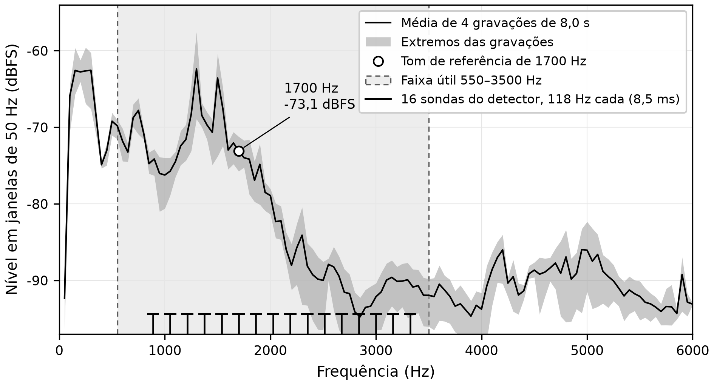
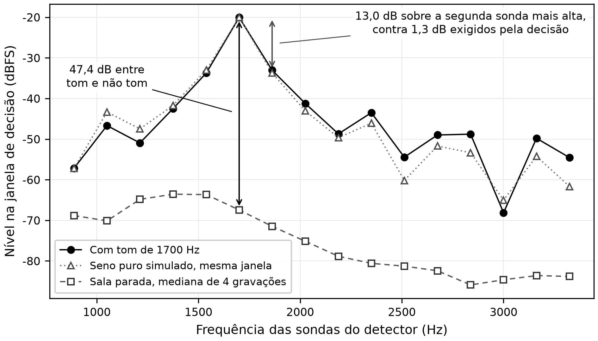
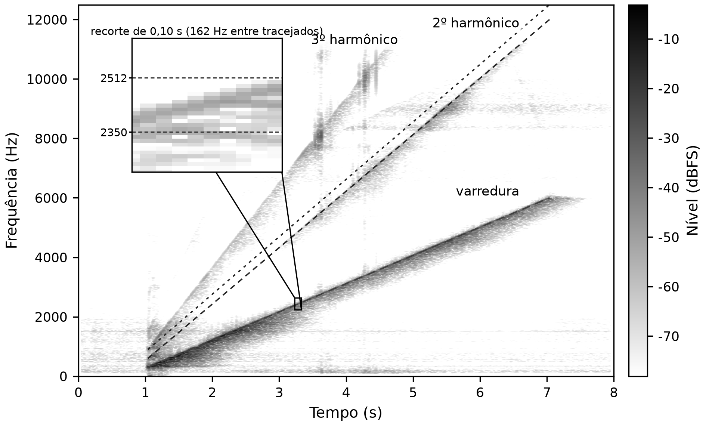
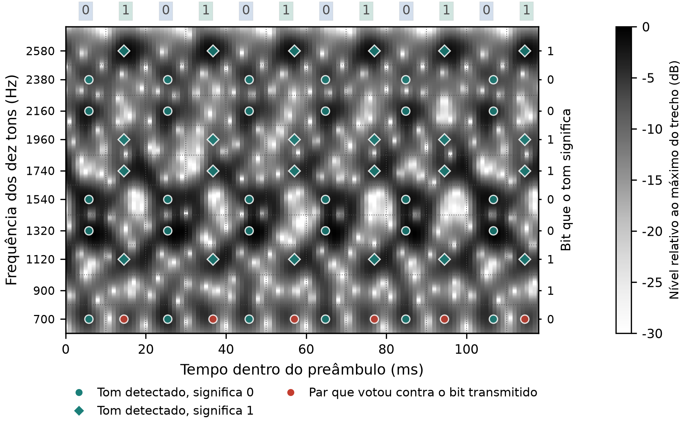
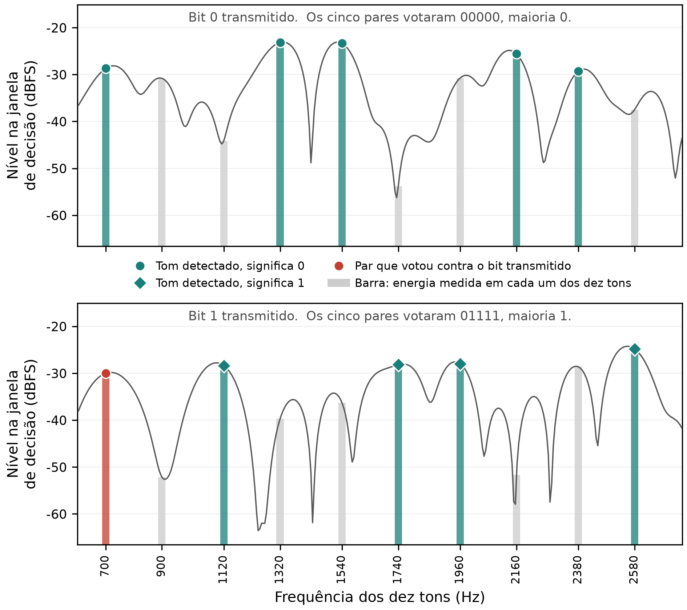
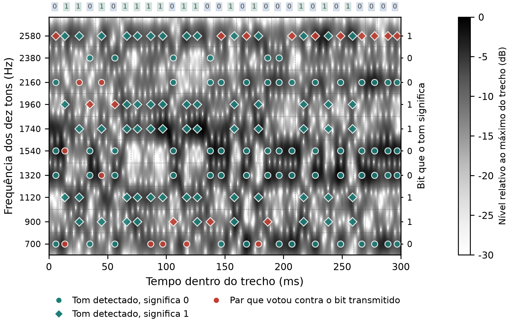
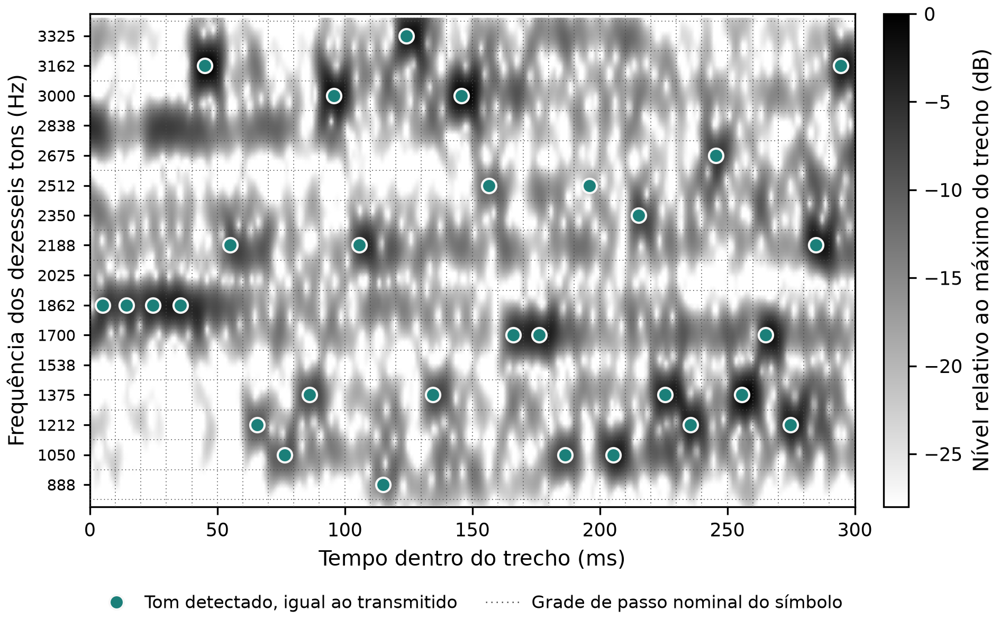
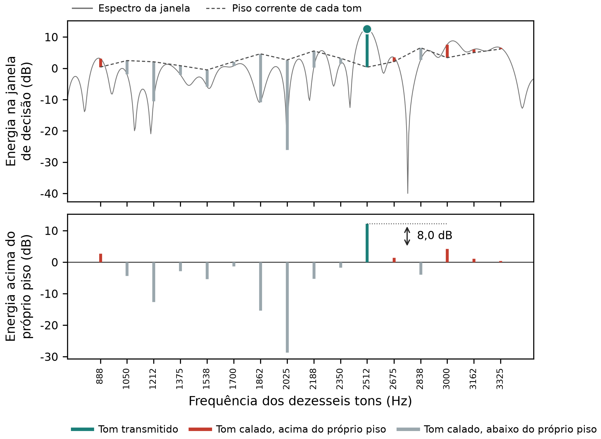
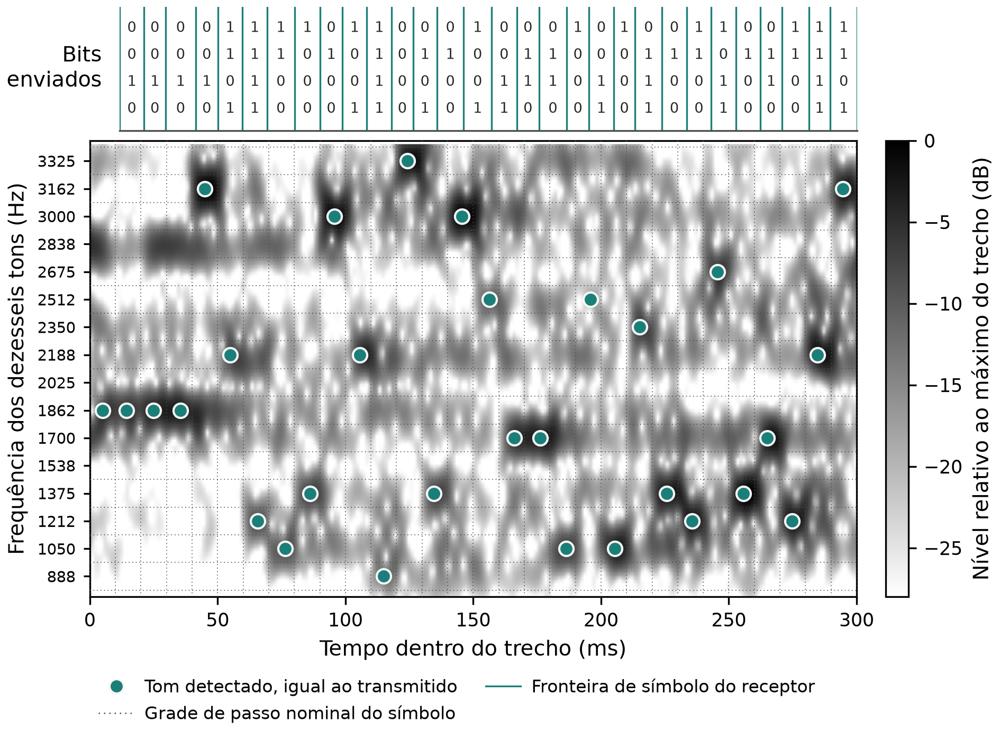

<!--
FONTE DO TEXTO. VII SIMECA / IFPR. Artigo do modem acustico.

Montagem: ./artigo/monta.sh  (gera artigo_modem.docx e artigo_modem.pdf; aceita --verifica, --sem-figuras)
Conversor: artigo/simeca-md. Correcao no conversor se faz la, nunca por copia.
Estilo: artigo/estilo.md. Ler antes de redigir qualquer secao.

ESTRUTURA (decisao do autor, 2026-09-06): 1 INTRODUCAO (uma lauda no maximo), 2 PRINCIPIO DE FUNCIONAMENTO,
  3 METODO DE MEDICAO, 4 RESULTADOS EXPERIMENTAIS, 5 CONSIDERACOES FINAIS. O modelo do evento sugere uma
  secao de fundamentacao teorica; e a forma de outro professor, nao regra de conteudo, e nao se segue. Nao ha
  secao de teoria: cada mecanismo traz a teoria minima que o sustenta, no ponto em que e usado. Objetividade
  antes de volume, em toda secao.
Secoes nao numeradas do modelo (AGRADECIMENTOS, FINANCIAMENTO, DECLARACAO DE IAG, CONFLITO, REFERENCIAS) ficam.
Extensao: 4 a 10 laudas. Resumo 150-300 palavras; 3 a 5 palavras-chave separadas por ponto final.
Legenda de figura ABAIXO do elemento; legenda de tabela ACIMA. Equacao centralizada e numerada a direita.
Citacao ABNT autor-data; "et al." em italico e sem ponto em "et".

Orcamento, em palavras de prosa (~750 por lauda; figura ou tabela 150-250):
  resumo 300 | introducao 450 | principio 900 | metodo 350 | resultados 750 | consideracoes 200
Contagem: wc -w artigo/artigo_modem.md  (inclui comentarios; descontar)

Convencoes: um paragrafo = uma linha; sem travessao na prosa; equacoes $...$ e $$...\tag{N}$$;
  figura como  seguida da linha "Figura N - legenda";
  "Tabela N - legenda" na linha antes da tabela em pipes; numeracao e conferida, nao gerada.
Nenhum numero entra sem origem em resultados/<pasta>.
CITACOES: nenhuma referencia foi inventada. "(CITAR: ...)" marca onde entra aglomerado e de que tipo.

ENQUADRAMENTO (decisao do autor, 2026-09-05): artigo didatico. Apresenta o sistema proposto, compara
brevemente com outros meios de transmissao, avalia o problema do canal acustico e propoe uma solucao para
este caso. Nao pretende substituir outro meio nem reivindicar melhoria sobre a literatura.

NOMENCLATURA (decisao do autor, 2026-09-05; fixa, nao muda mais):
  M-aria: modulacao de ordem M, em que cada simbolo e um tom escolhido entre M frequencias e carrega
    log2(M) bits. Abrange as quatro formas, inclusive a binaria (M = 2).
  FSK: modulacao por chaveamento na frequencia, do ingles *frequency shift keying* (FSK). Designa a 2-FSK.
  MFSK: chaveamento em multiplas frequencias, do ingles *multiple frequency shift keying* (MFSK). Designa
    as que usam mais de duas frequencias: 5x2-FSK (nas duas variantes) e 16-FSK.
  As quatro formas, sempre por esta notacao: 2-FSK; 5x2-FSK votada; 5x2-FSK multicanal; 16-FSK.
  Nunca: "20-FSK"; "M-ario" sem o M explicado; "MFSK" como nome de uma unica forma; nomes internos do
    codigo (mary, mfsk-par, fecrep) na prosa.
  Desvio em relacao ao codigo e ao CLAUDE.md da raiz: la "MFSK" e a de cinco pares e "M-ary" e a de
    dezesseis tons. No artigo nao. A correspondencia esta no CLAUDE.md da raiz.
  Forma de toda sigla estrangeira: nome em portugues, "do ingles", termo em italico, sigla entre
    parenteses depois do termo.

ESTADO DO TEXTO (2026-09-07, depois do merge das duas maquinas). O artigo esta sendo montado de tras
  para frente, comecando pelos RESULTADOS, com o que existe em ../resultados/. Cada figura mora na pasta da
  campanha que a gerou; artigo/figuras/ recebe copia para a montagem.
  SECOES 1 e 2: as desta maquina, reescritas em 2026-09-07 por decisao do autor, e mantidas no merge no
  lugar dos tocos "a redigir depois dos resultados" da versao remota. A 1 fala so de FSK, Bell 202, HART e
  transmissao por som, com quatro fontes lidas em PDF. A 2 tem 2.1, o meio, e 2.2, as quatro formas; a 2.3
  foi recolhida e o texto dela esta no comentario da 2.2.
  SECAO 4: a versao remota, redigida do fim para o comeco, com tres figuras que moram nas pastas 01, 02 e
  03 do sentido A2B.
  SECOES 3 e 5: como a versao remota as deixou, a redigir.
  As quatro contradicoes entre a 2.1 e a secao 5 foram fechadas em 2026-09-07, a pedido do autor e sempre
  mexendo na 1 e na 2: a secao 5 e a regua. O historico de cada uma esta no comentario da 2.1.
  ABERTO, depois da poda da secao 5 em 2026-09-07, que corrigiu de passagem os dois erros de fato que
  estavam listados aqui (os dez tons que sao cinco, e o 1,3 dB que era razao de 1,3). Restam dois pontos,
  os dois de estrutura:
  c) a secao 5 nao usa a notacao fixa. Ela diz "a primeira forma de transmissao medida" e "a segunda", e a
     "primeira" dela e' a SEGUNDA da 2.2, que apresenta as quatro em outra ordem. O leitor nao liga uma
     coisa a outra. A notacao esta fixada no CLAUDE.md desta pasta e a 2.2 a segue.
  d) a secao 5 se apoia na correcao de erros (os 48 bytes que chegam identicos sao o resultado dela) e a
     secao 2 nao a apresenta, porque a 2.3, "Sincronismo e correcao de erros", foi recolhida por decisao
     do autor "por enquanto". O texto dela esta preservado no comentario da 2.2. Voltar a 2.3 ou passar a
     apresentacao para a 3 e' decisao do autor.
  RENUMERACAO, 2026-09-07: a camada fisica virou a secao 3 e a camada de enlace a 4, entao os
  RESULTADOS passaram a ser a 5 e as consideracoes a 6. Este bloco ja fala na numeracao nova.
  O ponto (d) esta fechado: a correcao de erros passou a ser apresentada na secao 4, a camada de
  enlace, e nao volta para uma 2.3. O ponto (c) segue aberto e e' da secao 5.
-->

# Transmissão de dados por som audível entre dois computadores: o canal acústico medido e um modem para ele

<!--
Titulo: objeto + problema + solucao, tom didatico, sem promessa de melhoria. Maximo 3 linhas. Candidatos:
- Transmissão de dados por som audível entre dois computadores: o canal acústico medido e um modem para ele
- Um modem acústico com placa de som e microfone: da modulação binária ao M-ário com correção de erros
- Enlace de dados pelo ar audível: o que o canal faz com o sinal e o que se fez a respeito
-->

**AUTORES:**

<!--
nome | ORCID | filiacao | e-mail. Modelo exige ORCID de TODOS os autores, com o link correto.
Linha 1: o proprio Winderson preenche ORCID, campus e e-mail.
-->

1. Winderson | | IFPR | 
2. Jefferson Wilhelm Meyer Soares | 0000-0003-3372-9298 | IFPR, Campus Jacarezinho | jefferson.soares@ifpr.edu.br

**DOI:** https://doi.org/10.5281/zenodo.XXX

## RESUMO

<!--
Redigido e aprovado em 2026-09-05. Ordem: o que apresenta; o problema, que e o meio; a solucao em duas
camadas; a implementacao e o metodo; os numeros. So a ultima frase tem numero.
Fonte dos numeros: resultados/14-FEC-REP, resultados/15-PKT-ARQ.
-->

Este artigo apresenta a transmissão de dados por som audível entre dois computadores, com alto-falante e microfone comuns, expondo o enlace à aplicação como uma porta serial. O meio acústico impõe condições severas: a banda audível comporta poucas unidades de informação por segundo, aqui chamadas de símbolos, a amplitude que chega não é a que saiu, frequências vizinhas chegam com vários decibéis de diferença, o eco de um símbolo invade o seguinte, o ruído e a fala ocupam a mesma banda, e o hardware também pode saturar e distorcer o sinal. Tratamos essas dificuldades em duas camadas. Na física, conferimos quatro modulações de ordem M, ditas M-árias, em que cada símbolo é um tom escolhido entre M frequências e carrega tantos bits quanto essa escolha permite: a 2-FSK binária, modulação por chaveamento na frequência, do inglês *frequency shift keying* (FSK), e três por chaveamento em múltiplas frequências, do inglês *multiple frequency shift keying* (MFSK), a 5×2-FSK com o mesmo bit em cinco canais e decisão por voto, a 5×2-FSK multicanal com cinco bits em paralelo, e a 16-FSK com quatro bits por símbolo. Mesmo na melhor dessas formas, parte dos bits pode chegar com erro ou se perder, e na camada de enlace implementamos a correção antecipada de erros, do inglês *forward error correction* (FEC), o sincronismo de quadro por palavra de referência, a segmentação do arquivo em pacotes com verificação de redundância cíclica, do inglês *cyclic redundancy check* (CRC), e a retransmissão automática, do inglês *automatic repeat request* (ARQ). Medimos cada recurso sobre gravações do mesmo enlace, para comparar as variantes sobre o mesmo ar. Na melhor configuração o enlace entregou cerca de 11 bytes por segundo com 12 blocos íntegros em 12, e um arquivo de 1334 bytes chegou idêntico em 21 pacotes de 21, sem reenvio.

**PALAVRAS-CHAVE:** Modem acústico. Modulação por chaveamento de frequência. Codificação convolucional. Canal acústico.

## 1 INTRODUÇÃO

<!--
Refeita 2026-09-07. Escopo estreitado por decisao do autor: a introducao fala SO de FSK, Bell 202,
protocolo industrial HART e transmissao de dados por som. Saiu a comparacao entre cabo, radio,
infravermelho e som, e saiu com ela a Tabela 1, que existia so para aquela comparacao. Saiu tambem o
paragrafo de OFDM e chirp, que apresentava ferramentas do campo nao usadas aqui.
Cinco paragrafos: o que e FSK e o que o Bell 202 fixa; o Bell 202 vivo, no HART; o mesmo principio no
ar; o que o ar cobra; o que apresentamos.
Uma frase de cada artigo, e as quatro fontes foram LIDAS no PDF, nao no resumo:
  P1 FINNEGAN e BENSON (2014), p. 2: "The Bell 202 protocol is an audio frequency shift keyed (AFSK)
     modulation that encodes data by shifting between 1200Hz and 2200Hz audio tones. These tones
     represent a binary one and zero respectively and transitions occur at a rate of 1200 symbols per
     second. Originally developed by AT&T for use on the telephone network".
  P2 WU (2023), p. 2 e 4: "a backward-compatible enhancement to 4-20 mA instrumentation that allows
     two-way communication with smart, microprocessor-based field devices"; "The standard HART
     transmission is a frequency shift keyed (FSK) signal superimposed on the 4-20mA signal. The FSK
     bits are transmitted at 1200 bits per second"; a figura 1-3 marca 1200 Hz em "1" e 2200 Hz em "0",
     o que encerra a divergencia com as fontes secundarias que dizem 2400 Hz.
  P3 LOPES e AGUIAR (2001), p. 1: "Inter-machine communications have always been kept away from our
     own communication channel, audible sound in air. There are good reasons for this: the data rates
     are relatively low when compared to other media (e.g. electric wires, radio) and the sounds tend to
     be annoying. But as more and more devices support an audio channel for voice or music, that
     channel becomes a cheap option for transferring arbitrary information among devices that happen
     to be near each other."
  P4 PUTZ et al. (2026), p. 2: "sound waves travel more than 87 000 times slower than electromagnetic
     waves, leading to delay spreads on the order of tens of milliseconds"; e "Commercial products for
     acoustic data transmission on smart devices typically achieve only 10-200 bps"; a revisao e de 31
     estudos com mais de 11000 transmissoes.
P5 nao cita: e o que fizemos. Nenhum numero desta bancada entra aqui; ficam na secao 5.
NUMERACAO DE TABELA: a Tabela 1 saiu, entao a antiga Tabela 2 vira Tabela 1 e assim por diante. Nao
renumerei porque as secoes 3 a 5 estao em merge com a versao remota; renumerar depois do merge.
-->

A modulação por chaveamento na frequência, do inglês *frequency shift keying* (FSK), põe dados num canal de voz comutando a portadora entre duas frequências, uma para cada valor do bit. O padrão Bell 202 fixa essas duas frequências em 1200 e 2200 Hz, com transições a 1200 símbolos por segundo, e foi desenvolvido pela AT&T para a rede telefônica (FINNEGAN; BENSON, 2014). Um canal projetado para conduzir voz passa a conduzir bytes sem que nada no meio precise mudar.

O Bell 202 não é peça de museu. O protocolo de transdutor remoto endereçável em barramento, do inglês *Highway Addressable Remote Transducer* (HART), superpõe um sinal FSK de 1200 bits por segundo à malha de 4 a 20 mA que liga o transmissor de campo ao sistema de controle, sem perturbar o valor analógico que ela já carrega (WU, 2023). A retrocompatibilidade é o que o difundiu, pois o instrumento antigo filtra o sinal digital e continua medindo como antes.

O mesmo princípio vale no ar, e Lopes e Aguiar (2001) já observavam por que quase ninguém o usa assim. A comunicação entre máquinas sempre foi mantida longe do som audível por duas boas razões, a taxa baixa diante do fio e do rádio e o incômodo do som. A contrapartida é que o canal de áudio existe em cada aparelho, o que o torna uma opção barata de transferir informação entre dispositivos próximos, sem instalar nada.

O ar, porém, não é o par de fios. O som viaja mais de 87000 vezes mais devagar que a onda eletromagnética, de modo que as reflexões da sala se espalham por dezenas de milissegundos, e o multipercurso em ambiente fechado é a maior degradação dos esquemas acústicos publicados (PUTZ *et al.*, 2026). Na mesma revisão, de 31 estudos e mais de 11000 transmissões em aparelhos reais, os produtos comerciais entregam de 10 a 200 bits por segundo, que é a ordem de grandeza a esperar do meio.

Apresentamos um modem acústico que leva bytes de um computador a outro por som audível, com alto-falante e microfone comuns, e que se expõe à aplicação como uma porta serial. Partimos das duas frequências do Bell 202 e chegamos a dezesseis tons com correção de erros, e cada passo respondeu a um limite que medimos no ar. Verificamos o conjunto entre duas máquinas na mesma sala, transferindo um arquivo inteiro pelo ar.

## 2 PRINCÍPIO DE FUNCIONAMENTO

<!--
Redigida 2026-09-06. Mecanismo em palavras antes de qualquer equacao; a teoria minima de cada mecanismo
entra onde ele e usado. O canal primeiro, porque tudo o que segue e resposta a ele. Fronteira da fisica:
entrega simbolos e a verossimilhanca de cada bit; o enlace opera em bits, nunca em amostras.
-->

### 2.1 O meio acústico

<!-- Fonte: resultados/02-LVL-TONE e 02-LVL-TONE-A2B (tom pisado, unica frequencia medida assim),
03-CH-CHIRP-A2B (varredura), 12-13-SYNC.
CORRIGIDO 2026-09-07. O texto anterior dizia "medida tom a tom [...] a banda util vai de 550 a 3500 Hz" e
"acima de 4 kHz a SNR cai, 12 dB a 4000, 8 dB a 4500, zero a 5000, negativa acima de 6 kHz". Nada disso
tem origem em resultados/: o 02-LVL-TONE mede UMA frequencia, 1700 Hz, e os numeros de 4/4,5/5/6 kHz nao
aparecem em HEADER nenhum. A varredura A->B, repontuada em 2026-09-07 sobre a copia float32 local, mede o
contrario: 58,3 dB a 4012 Hz, 55,3 a 4462, 46,0 a 4988, e os melhores pontos de toda a varredura ficam
entre 4,1 e 4,4 kHz. O que cai com a frequencia e o NIVEL, nao a SNR, porque o piso cai mais rapido.
As duas varreduras discordam (A->B: 76 de 76 bins positivos; B->A: 74 de 76 negativos) e o proprio HEADER
do B->A explica: 4,0 s contra 6,0 s, pouca energia por Hz. Pela doutrina do projeto (medir uma frequencia
mandando aquela frequencia) nenhuma varredura decide SNR, e so o tom pisado decide, em 1700 Hz.
Numeros do pente recalculados a 50 Hz sobre a varredura A->B: degrau entre vizinhos com mediana 2,5 dB,
p90 6,5 dB, maximo 13,0 dB; excursao de 27,6 dB dentro de 550-3500 Hz; os 16 tons caem entre -5,7 e
-27,8 dB. O "13 a 18 dB" anterior valia como maximo e exagerava cinco vezes como faixa tipica.

AMPLIADA e depois ENCURTADA DUAS VEZES em 2026-09-07, a pedido do autor: 822 palavras, depois 649, agora
cerca de 495, contra 596 antes da ampliacao. Criterio: fica o que o leitor precisa para entender o canal,
sai o que so defende a metodologia, recapitula o que ja foi dito ou responde pergunta que ninguem fez.
O QUE FOI CORTADO, para nao ser reescrito por engano:
  - o paragrafo do ultrassom, com a banda de 22 kHz e os 4 kHz do modo inaudivel. Sobrou uma oracao, no
    paragrafo da SNR, porque a regra de estilo exige dizer o que ficou fora e com que razao. Com ele saiu
    a citacao de PUTZ et al. 7.3.3, sobre seletividade na banda quase-ultrassonica.
  - a discordancia entre as duas varreduras. E defesa de metodo, nao entendimento do meio; fica no
    comentario acima, que e onde ela importa.
  - os 30 dB SPL de dispersao entre modelos, de PUTZ et al. 7.3.2, de proposito: os demais decibeis desta
    secao sao amplitude de amostra em gravacao, medida relativa, e os 30 dB deles sao nivel de pressao
    sonora. Duas reguas na mesma unidade e no mesmo paragrafo confundiriam.
  - a condicao exata da interferencia ("o periodo cabe um numero inteiro de vezes na diferenca de
    percurso"). O leitor precisa saber que somam ou se cancelam conforme a frequencia; a condicao exata
    e verdadeira e nao muda nenhuma decisao do projeto.
  - as oracoes "porque..." das tres exigencias, que repetiam o que os paragrafos anteriores acabaram de
    dizer. A regra do autor manda cortar recapitulacao.
  - "cada uma das tres faltas cobra um preco diferente", da abertura, que e meta-discurso.
  - a FIGURA 1 INTEIRA, por decisao do autor em 2026-09-07: nada de imagem nesta secao. O numero que ela
    carregava sobreviveu na prosa, que e a excursao de 22 dB entre o tom mais forte e o mais fraco. Saiu
    com ela a unica imagem existente no artigo; as Figuras 2 a 5 nunca existiram como arquivo, e seguem
    citadas na prosa das secoes 2.2, 3 e 4, que nao foram alteradas aqui.
    O arquivo figuras/resposta-canal.png e o figura_canal.py que o gera ficaram sem uso. NAO foram
    apagados: a decisao de remove-los do repositorio e do autor, e o script ainda documenta como a
    varredura foi repontuada.
Tres citacoes sobreviveram, todas de PDF lido: LOPES e AGUIAR (2001) no pente, PUTZ et al. (2026) no eco
e no estouro. As frases exatas de origem estao em referencias.md.
O eco continua entrando como PROPRIEDADE DO MEIO e o paragrafo fecha pela negativa, dizendo que esta sala
nao tem cauda mensuravel. Nao virou dificuldade vencida, que os resultados desmentiriam.

=== CONTRADICOES COM A SECAO 4, FECHADAS EM 2026-09-07 ===
Decisao do autor: a secao 5 e a regua, e o acerto se faz na 1 e na 2. As quatro estao resolvidas; o que
cada uma dizia esta abaixo, para nao ser reescrito por engano.

1. A CAUDA. A 2.1 dizia "nesta bancada a cauda nao e mensuravel, o sinal para no piso de ruido". A secao 5
   mediu o contrario e a 2.1 cedeu: agora diz que o som nao cessa junto com a fonte e manda para a 4, que
   mede sem atribuir a origem. Vale saber o que a 4 mediu, porque nao e a banda de trabalho: em
   5600-6400 Hz, onde a rampa da varredura terminou, com janela de 512 amostras, cerca de 50 dB em meio
   segundo, chegando ao piso da sala por volta de 0,8 s (resultados/03-CH-CHIRP-A2B/figuras/COMO-REFAZER.md,
   item 3). O "no measurable reverberation" do CLAUDE.md da raiz veio de outra medida, sobre burst na banda
   de trabalho, e ganhou a ressalva la.
2. BANDA 550-3500 Hz. A 2.1 afirmava a banda e o nivel "12 a 20 dB" acima dela; os dois sairam. No lugar
   ficam os 700 a 3325 Hz que os tons de fato ocupam, que se conferem em modem.py e nao em varredura
   nenhuma. O ULTRASSOM FICOU, e de proposito: aquele paragrafo se apoia so em PUTZ et al. (2026) e na
   absorcao do ar, nao em medicao desta bancada, e a regra de estilo manda dizer o que ficou fora e por que.
3. EXCURSAO DE NIVEL. Os 28 dB da 2.1, em bins de 50 Hz, sairam. A excursao fica com a secao 5 e com a
   regua dela, 23,7 dB em passos de 74 Hz na faixa dos dezesseis tons. Duas reguas para a mesma ideia era
   o problema, e uma frase qualitativa na 2.1 com o numero na 4 resolve sem perder nada.
4. DEGRAU ENTRE VIZINHOS. Mesmo tratamento: sairam a mediana de 2,5 dB e o maximo de 13 dB (este ultimo
   nao se reconferia, procedencia.md mede 10,6 dB e mostra que o extremo depende de onde a analise comeca).
   A 2.1 diz que vizinhos chegam a diferir varios decibeis, a 4 da o "ate 9,4 dB".

A omissao tambem foi fechada: a 2.1 ganhou um paragrafo dizendo que o piso de ruido tem forma e mandando
para a 4, que mede a concentracao na metade inferior da banda. -->

Transmitir pelo ar é converter a sequência de amostras em variação de pressão, deixá-la atravessar a sala a 343 m/s e reconvertê-la em amostras do outro lado. Entre um conversor e outro estão o amplificador, o alto-falante, o ar, as superfícies que refletem e o microfone. Esse canal não é plano, não é linear e não é silencioso.

O ruído do ambiente ocupa parte significativa da mesma banda, vindo do tráfego, de máquinas, da fala e do próprio manuseio dos aparelhos, em componentes tanto contínuos quanto em rajada (PUTZ *et al.*, 2026).

Esse ruído também não é plano ao longo da banda. A seção 5 mede a forma dele nesta sala, concentrado na metade inferior, de modo que dois tons de frequências diferentes não disputam com o mesmo fundo.

Um alto-falante e um microfone de uso geral respondem bem na banda da fala e perdem eficiência nos extremos. Colocamos os tons entre 700 e 3325 Hz, dentro dessa região, e mesmo ali a resposta está longe de ser plana, como a seção 5 mede.

O ultrassom atrai porque a sala fica silenciosa acima da banda da fala e a transmissão não incomoda quem está por perto. A amostragem usual de 44,1 ou 48 kHz fecha a banda abaixo de 22 kHz, exigir inaudibilidade a reduz a menos de 4 kHz, e nessa faixa o hardware de áudio é fortemente seletivo (PUTZ *et al.*, 2026). A absorção do ar cresce com a frequência e encurta o alcance, e por isso o ultrassom fica fora deste trabalho.

Dentro da banda o sinal chega ao microfone pelo caminho direto e pelas reflexões nas superfícies da sala, cada uma atrasada pelo percurso que fez. Uma cópia atrasada reforça o som direto nas frequências cujo período cabe um número inteiro de vezes na diferença de percurso, e o cancela naquelas em que essa diferença vale meio período. Como a condição depende da frequência, a resposta do canal é um pente de máximos e nulos alternados, e a geometria da sala fixa o espaçamento entre eles.

Frequências separadas por algumas dezenas de hertz chegam assim a diferir vários decibéis, e a posição dos nulos muda quando alguém se move. Lopes e Aguiar (2001) já apontavam essas reflexões como a razão de não se confiar em muitos níveis de amplitude no ar.

As mesmas reflexões, vistas no tempo, são a reverberação. Depois que a fonte cala o som persiste enquanto as ondas ainda percorrem a sala perdendo energia a cada superfície, e enquanto essa cauda dura a energia de um símbolo invade o seguinte. Em ambiente fechado o espalhamento chega a dezenas de milissegundos, absorvido por intervalo de guarda (PUTZ *et al.*, 2026). Nesta bancada o som também não cessa junto com a fonte, e a seção 5 mede o que sobra depois de uma varredura, sem isolar a origem entre a sala, o alto-falante sem fio e o codec dele.

A cadeia analógica também não é linear. O cone do alto-falante tem excursão limitada e o amplificador, tensão limitada, então os picos são achatados quando o nível cresce, e o microfone comprime do mesmo modo na outra ponta. A energia retirada dos picos reaparece como harmônicos e intermodulação, parte deles dentro da própria banda de trabalho, onde nenhum filtro os separa do sinal. Passado esse ponto, subir o nível piora a recepção.

O estouro não é particularidade desta bancada. Putz *et al.* (2026) mediram distorção não linear na maioria dos aparelhos acima de cerca de 75% do volume máximo, num enlace de mão única, sem realimentação que corrija o ganho.

Disso decorrem duas exigências. A decisão do receptor não pode depender da amplitude absoluta de nenhum tom, e o nível de operação tem de ser encontrado por medição.

### 2.2 As quatro formas de transmissão

<!--
REESCRITA 2026-09-07, a pedido do autor: descrever melhor o nosso trabalho, como modulamos e como
detectamos cada uma das quatro formas. Titulo novo; era "Modulacao", que nao dizia que a secao e sobre
as quatro formas que construimos. O termo "quatro formas de transmissao" e o vocabulario ja fixado no
CLAUDE.md desta pasta.
A 2.3, "Sincronismo e correcao de erros", foi RETIRADA por decisao do autor em 2026-09-07, "por
enquanto". O texto dela esta preservado no fim deste comentario, para voltar sem ser reescrito.

NUMEROS CONFERIDOS NO CODIGO EM 2026-09-07, nao no CLAUDE.md:
  2-FSK: MARK 1200 Hz, SPACE 2200 Hz, 1200 baud, 8N1; deteccao por atraso e produto, atraso de um
    quarto de periodo em 1700 Hz; fase continua entre simbolos.
  5x2-FSK: MFSK_PAIRS = (700,900) (1320,1120) (1540,1740) (2160,1960) (2380,2580), 200 Hz dentro de
    cada par, 100 baud. Polaridade alternada conferida par a par: nos pares 0, 2 e 4 o tom grave e o
    bit 0; nos pares 1 e 3 e o bit 1. Media dos acordes recalculada aqui: 8100/5 = 1620 Hz para o
    acorde do bit 0 e 8300/5 = 1660 Hz para o do bit 1, o que confirma o CLAUDE.md.
    MFSK_PRESENCE_MIN = 1.3.
  16-FSK: MARY_TONES, dezesseis tons de 888 a 3325 Hz; espacamento conferido, 162 Hz constante
    (1050-888 = 162, 3325-3162 = 163 por arredondamento). MARY_BITS = 4, codigo Gray, 100 baud.

CORRECAO, e ela vale para o CLAUDE.md da raiz tambem: O INTERVALO DE GUARDA E 15%, NAO 35%.
  O padrao entregue e guard=0.15 em MFSKDemodulator (linha 397) e MaryDemodulator (linha 796), e o
  descarte e no INICIO do simbolo, np.arange(self.guard, samples_per_symbol).
  Os 35% aparecem em dois lugares e nenhum e o caminho vivo: loopback_test.py linha 119, num caso
  deliberadamente ajustado para reverberacao ((0.35, 0.15, True)), e console.py linha 605, numa
  varredura de diagnostico que repontua audio guardado. O CLAUDE.md da raiz descrevia o caso de teste
  como se fosse o comportamento entregue, e a versao anterior desta secao repetia o erro; os dois
  CLAUDE.md foram corrigidos em 2026-09-07 e agora dizem 15%.

O marcador "(CITAR: modulacao M-FSK, deteccao nao coerente)" foi retirado: pela decisao de escopo do
autor, a literatura serve a introducao e a 2.1, e daqui para a frente o texto se sustenta no que
construimos e medimos. PROAKIS e SALEHI (2008) continua levantado em referencias.md, grupo G5, se o
autor quiser citar livro-texto para o principio M-ario.
A remissao "A Figura 2 mostra o espectro de cada uma" tambem saiu, porque nao ha figura no artigo.

TEXTO DA 2.3 RETIRADA, para restaurar quando o autor pedir:
  "O bloco e localizado por uma palavra de referencia de 31 bits, correlacionada sobre as LLR
  recebidas, nunca por contagem de simbolos, pois o gate consome numeros diferentes de amostras por
  simbolo enquanto ajusta. E a mesma correlacao que resolve o alinhamento de nibble da 16-FSK, em que
  um simbolo a mais antes do bloco troca os nibbles de todos os bytes. Acima do bloco, o arquivo vai
  em pacotes com numero de sequencia, comprimento e CRC-16, reenvio pare-e-espere dirigido pelo
  receptor, transmissor sem estado. A aplicacao ve uma porta serial virtual."
-->

Chamamos M-ária a modulação de ordem $M$, em que cada símbolo é um tom escolhido entre $M$ frequências e carrega $\log_2 M$ bits, e a taxa de bits é o produto de (1).

$$R_b = R_s \log_2 M \tag{1}$$

Nela, $R_b$ é a taxa de bits, $R_s$ é a taxa de símbolos em bauds e $M$ é o número de frequências. Subir $M$ é o caminho para subir $R_b$, com a taxa de símbolos presa pela banda e pelas reflexões. Construímos quatro formas, e o que muda entre elas é quanto a decisão depende da amplitude. Elas ocupam as duas famílias que Lopes e Aguiar (2001) já haviam formulado, a de um tom por símbolo e a de $k$ tons simultâneos.

A 2-FSK usa os dois tons do padrão Bell 202, 1200 e 2200 Hz, a 1200 símbolos por segundo, com os bytes em 8N1 e fase contínua na troca de tom.

O demodulador multiplica o sinal filtrado por uma cópia atrasada de um quarto de período em 1700 Hz, e a média do produto muda de sinal conforme o tom presente. O limite é o limiar, pois um canal que atenue um tom mais que o outro enviesa toda decisão no mesmo sentido.

A 5×2-FSK votada troca o limiar por comparação. Cinco pares de tons carregam o mesmo bit a 100 símbolos por segundo, com 200 Hz dentro de cada par, e cada par vota no tom que chegou mais forte. Como o voto é uma razão, multiplicar o sinal por qualquer fator não muda o resultado.

A polaridade alterna ao longo da banda, de modo que os dois acordes ficam com frequência média quase igual, 1620 e 1660 Hz, e um canal inclinado não favorece nenhum bit. Um segundo critério exige que a razão entre vencedor e perdedor passe de 1,3, sem o que o ruído elegeria um bit em sala vazia.

A 5×2-FSK multicanal usa os mesmos dez tons com um bit distinto em cada par, cinco bits por símbolo. O limite das duas formas de cinco pares é potência, pois o pico que o alto-falante aceita é fixo e cada um dos cinco tons sai 14 dB abaixo do que sairia sozinho.

A 16-FSK devolve essa potência. São dezesseis tons de 888 a 3325 Hz, espaçados 162 Hz, e exatamente um soa por vez, quatro bits por símbolo, com os valores em código Gray para que confundir um tom com o vizinho custe um bit e não quatro, o que vale em doze dos quinze pares vizinhos.

A tarefa do detector é decidir quais frequências estão presentes, sem informação de fase (LOPES; AGUIAR, 2001). O receptor mede a energia de cada tom, divide pelo piso corrente daquele tom e elege o maior, conforme (2).

$$\hat{s} = \arg\max_k \frac{E_k}{P_k} \tag{2}$$

Nela, $E_k$ é a energia no tom $k$ e $P_k$ é a média corrente dessa energia. Como cada tom fica em silêncio quinze símbolos em dezesseis, essa média é o piso de ruído naquela frequência, e um tom caído num nulo passa a ser comparado com o próprio nulo.

As três formas de 100 bauds recuperam o relógio de símbolo do próprio sinal, com um gate de adiantamento e atraso, porque as duas máquinas contam o tempo por osciladores independentes. Elas descartam os primeiros 15% de cada símbolo como guarda. A transmissão abre com preâmbulo alternado, que dá ao gate transições para travar, e fecha com cauda ociosa.

## 3 CAMADA FÍSICA

<!--
Redigida 2026-09-07. A secao 3 era "METODO DE MEDICAO", esqueleto vazio, e foi substituida. A numeracao
do modelo do evento foi dispensada por decisao do autor nesta data: fisica em 3, enlace em 4, resultados
em 5, consideracoes em 6. As remissoes "a secao 4 mede" da 2.1 foram renumeradas para 5.
Escopo: o principio de funcionamento e a razao de cada escolha. NENHUM resultado desta bancada entra
aqui; onde o mecanismo existe por causa de uma medida, o texto remete a secao 5 sem dar o numero.
Todos os numeros foram conferidos em modem.py, nao no CLAUDE.md: tons, bauds, ordem e faixa dos filtros,
atraso de sete amostras, divisao da amplitude por cinco, 72 amostras de 480, tres janelas candidatas com
delta de um oitavo e passo de correcao de um trinta e dois avos.
DUPLICACAO COM A 2.2: a 2.2 descreve as quatro formas em cerca de 500 palavras e esta secao redescreve o
mecanismo. O corte na 2.2 e decisao do autor e esta anotado na resposta da sessao; nada da 2.2 foi
alterado aqui. As varreduras de sincronismo NAO entram nesta secao, para nao duplicar a 4, que as trata
inteiras.
GRAY, ponto aberto: o mapeamento implementado atribui ao valor v o tom de indice g(v) = v xor (v>>1),
o que NAO garante um bit de diferenca entre tons vizinhos. Conferido: dos quinze pares de tons vizinhos,
doze diferem em um bit e tres diferem em dois (os pares de indice 3-4, 7-8 e 11-12). A afirmacao da 2.2,
"para que a confusao do canal custe um bit e nao quatro", precisa virar "custe um bit na maioria das
confusoes". Esta secao nao repete a afirmacao.
-->

A camada física entrega ao enlace a verossimilhança de cada bit, e acima dela ninguém vê amostra nem frequência.

A 2-FSK sai do modulador com fase contínua na troca de tom, pois reiniciar a fase a cada símbolo cria degraus que espalham energia para fora da banda. Cada byte vai em 8N1, com partida em 0, os oito bits do menos significativo em diante e parada em 1.

A detecção é por atraso e produto. Um passa-faixa Butterworth de quarta ordem entre 800 e 2600 Hz limpa o sinal, que é multiplicado por uma cópia de si mesmo atrasada de sete amostras, um quarto de período em 1700 Hz, e um passa-baixa de quarta ordem em 1800 Hz filtra o produto. O resultado é positivo para um tom e negativo para o outro, e a decisão é o seu sinal.

Os dois filtros e a linha de atraso guardam estado entre blocos, pois recomeçá-los poria um transitório em cada fronteira e destruiria os bits ali.

Abaixo de um limite absoluto de banda base o receptor força marca em vez de decidir. Como o produto vai com o quadrado da amplitude, esse silenciador é quadrático, e um sinal fraco não chega errado, não chega, com o medidor ainda acusando energia na banda.

A fraqueza está na comparação com zero. Um canal que atenue 2200 Hz mais que 1200 Hz desloca a média do produto e enviesa toda decisão no mesmo sentido, sem que o receptor perceba.

A 5×2-FSK votada troca esse limiar por comparação dentro de cada par, separado por 200 Hz, pouco o bastante para que o canal trate as duas frequências quase igual. Multiplicar o sinal recebido por qualquer fator não muda vencedor nenhum, e a amplitude absoluta sai da decisão.

O voto sozinho decide também em sala vazia, pois uma razão entre dois ruídos ainda elege um vencedor. O tom perdedor de cada par é uma frequência que ninguém transmitiu, e a mediana da razão entre vencedor e perdedor abaixo de 1,3 rejeita o símbolo.

Os dez tons foram escolhidos contra harmônicos cruzados. A distorção do alto-falante e do microfone fabrica harmônicos, e nenhum segundo ou terceiro harmônico de um acorde cai sobre um tom do outro, onde serviria de prova a favor do símbolo errado.

Nas duas formas de cinco pares o pico que o alto-falante aceita é fixo e os cinco tons têm de caber juntos nele, então o modulador divide a amplitude por cinco e cada tom parte 14 dB abaixo do que partiria sozinho. A perda é anterior a qualquer decisão e o receptor não a recupera.

A 16-FSK devolve essa potência ao pôr um único tom no ar por vez, com toda a amplitude disponível. O preço é comparar dezesseis frequências espalhadas pela banda, que o canal não trata igual, em vez de duas vizinhas.

O piso corrente de (2) é uma média exponencial de fator 0,02 da energia de cada tom, atualizada deixando de fora o tom de maior energia do símbolo. A exclusão evita que o piso persiga o sinal que ele mede, e supõe que o tom mais forte é quase sempre o transmitido.

O relógio de símbolo das três formas de 100 bauds vem de uma malha de adiantamento e atraso. A cada símbolo o receptor pontua três janelas candidatas, deslocadas de um oitavo de símbolo entre si, decide pela de melhor contraste e corrige o instante do símbolo seguinte em um trinta e dois avos de símbolo. O contraste é máximo quando a janela cai dentro de um símbolo e mínimo quando cavalga a fronteira.

Dentro da janela escolhida, as primeiras 72 amostras de 480 são descartadas como intervalo de guarda, 15% do símbolo, e a decisão se faz sobre as 408 restantes. É no início que a cauda do símbolo anterior ainda está na sala, e alargar a guarda custa a resolução em frequência que separa um tom do vizinho.

O preâmbulo é alternado, pois a malha trava em transições e um preâmbulo constante não lhe ensina nada, e a rajada fecha com uma cauda ociosa, pois o demodulador guarda pouco mais de um símbolo e sem ela o último byte fica preso ali.

Na 16-FSK a saída não é o bit e sim a verossimilhança logarítmica de cada bit do símbolo, do inglês *log-likelihood ratio* (LLR), dada por (3).

$$\Lambda_j = \max_{b_j(v)=1} \ln \frac{E_{g(v)}}{P_{g(v)}} - \max_{b_j(v)=0} \ln \frac{E_{g(v)}}{P_{g(v)}} \tag{3}$$

Nela, $v$ percorre os dezesseis valores de quatro bits, $b_j(v)$ é o bit $j$ de $v$, $g(v)$ é o tom que o código Gray atribui a $v$, e $E$ e $P$ são os de (2). O sinal de $\Lambda_j$ é a decisão dura e o módulo é a confiança nela, que o demodulador já calcula para eleger o vencedor e antes descartava.

Esse fluxo sobe sem enquadramento algum, e começar um símbolo antes ou depois troca os quatro bits altos de cada byte pelos baixos. Quem resolve isso é a camada de enlace.

Um número fica de fora do projeto da camada, o nível com que o sinal parte. Ele depende do alto-falante, do microfone e da distância entre eles, uma cadeia saturada entrega distorção que decisão nenhuma recupera, e por isso ele é medido em vez de escolhido, como a seção 5 mostra.

## 4 CAMADA DE ENLACE

<!--
Redigida 2026-09-07, junto com a 3. Mesmo escopo: mecanismo e razao, nenhum resultado desta bancada.
Conferido no codigo, nao no CLAUDE.md: polinomios 171, 133 e 165 em octal e comprimento de restricao 7
(fec.py), seis bits de cauda, entrelacador por transposicao com profundidade 16 APLICADO DEPOIS da
repeticao, palavra de 31 bits NAO CODIFICADA a frente do bloco (fec.frame), mapa da copia r do bit i no
par (i+r) modulo o numero de pares (fec.pair_map), varreduras de 700 a 3400 Hz em 0,08 s com 30 ms de
silencio de cada lado (console.SYNC_HUSH = 0.03) e periodo aceito entre 0,98 e 1,02 do nominal
(console._sweep_llr), entrada de doze bytes 0x55, byte de sincronismo, sequencia, comprimento, carga e
CRC-16 CCITT-FALSE, embaralhamento chaveado pela posicao (xfer.py), ate quatro tentativas e preenchimento
com zeros (recvfile.py).
FEC, CRC e ARQ sao apresentados por extenso aqui porque, no corpo do artigo, e a primeira ocorrencia de
cada um; o resumo os apresenta a parte, como o modelo do evento pede.
-->

O canal entrega uma fração dos bits errada, e detectar o dano apenas o denuncia. Pedir de novo só converge quando a chance de o bloco chegar limpo já é alta, e é ela que falta. Os bits têm de ser reparáveis onde caem.

Dentro do bloco não há enquadramento 8N1, em que um bit de partida ou de parada corrompido desloca todos os bytes seguintes. O bloco de tamanho fixo não tem o que deslocar, o que remove o modo de falha em vez de atenuá-lo.

A correção antecipada de erros, do inglês *forward error correction* (FEC), é um código convolucional de comprimento de restrição 7, com polinômios geradores 171, 133 e 165 em octal, três bits codificados por bit de entrada. Seis bits de cauda zerados o fecham no estado zero, de onde o decodificador parte.

O decodificador é um Viterbi de decisão suave. Cada bit chega como uma verossimilhança logarítmica, positiva quando o canal pende para 1 e negativa quando pende para 0, e a métrica de cada ramo da treliça é a soma em (4).

$$\mu = \sum_{j=1}^{n} (2c_j - 1) L_j \tag{4}$$

Nela, $c_j$ é o $j$-ésimo bit que o ramo emitiria, $L_j$ é a verossimilhança recebida na mesma posição e $n$ é o número de bits codificados por passo. Um bit duvidoso quase não move $\mu$, e o percurso segue os bits em que o receptor está seguro. O bit incerto cede ao certo.

A redundância por repetição replica o bloco codificado e o decodificador soma as cópias, pois observações independentes do mesmo bit se somam no domínio da verossimilhança. A seção 5 mede o que ela compra neste enlace.

Um entrelaçador por transposição de matriz, com profundidade 16, é aplicado depois da repetição, e não antes. Assim as cópias de um bit caem distantes no tempo, e uma perturbação concentrada chega ao decodificador como erros isolados em vez de destruir todas as cópias de uma vez.

Na 5×2-FSK multicanal a independência exige um mapa próprio, pois o bloco codificado tem comprimento múltiplo do número de pares e ladrilhá-lo poria todas as cópias de um bit no mesmo par, derrubadas juntas por um nulo do pente. A cópia $r$ do bit $i$ vai para o par $(i+r)$ módulo o número de pares.

O bloco é localizado por uma palavra de referência de 31 bits, que viaja sem codificação à frente dele e é achada por correlação sobre o sinal das verossimilhanças, nunca por contagem de símbolos. O relógio consome números diferentes de amostras enquanto ajusta, o início do bloco escorrega ao longo do preâmbulo, e um bloco atrasado de um bit decodifica em nada.

É a mesma correlação que resolve o alinhamento de símbolo da 16-FSK, em que começar cedo ou tarde troca os quatro bits altos de cada byte pelos baixos. Na 5×2-FSK multicanal ela se faz sobre a média dos pares, um valor por símbolo, pois um par parado num nulo responde sempre o mesmo.

Duas varreduras de tom de 700 a 3400 Hz, de 80 ms cada, cercam o quadro, separadas dele por 30 ms de silêncio e recuperadas por filtro casado. A primeira dá o instante em que o quadro começa, e o intervalo entre as duas, dividido pelos símbolos que abrange, dá o período de símbolo, aceito enquanto ficar a 2% do nominal.

São varreduras e não estalos, pois o estalo tem a mesma detectabilidade com fator de crista pior, e esta camada já opera com pouca folga de pico contra a saturação. Elas fixam a amostra inicial e o período, e quem acha o bit segue sendo a palavra de referência.

Os picos se ordenam por posição, nunca por altura, porque as duas varreduras são idênticas e o canal decide qual chega mais forte.

O recurso é opcional e vem desligado, pois quem envia as varreduras a um receptor que não as espera põe 80 ms de tom varrido sobre os primeiros símbolos do preâmbulo. Os dois lados também têm de concordar na redundância, cuja divergência é indetectável no decodificador, que produz lixo reprovado na verificação e lido como canal ruim.

Acima do bloco corrigido, o arquivo vai em pacotes de doze bytes de guia alternados, um byte de sincronismo, número de sequência, comprimento e carga de até 255 bytes, mais dois bytes de verificação de redundância cíclica, do inglês *cyclic redundancy check* (CRC).

O corpo e o CRC são embaralhados por um gerador pseudoaleatório de semente fixa, chaveado pela posição e não pelo conteúdo, para que o comprimento seja lido antes do resto. O embaralhamento desfaz padrões repetidos e longas sequências iguais na carga, que privam o relógio das transições de que ele vive.

O CRC valida o pacote e é indiferente ao ruído antes e depois dele, pois qualquer candidato que feche a conta é um pacote.

A retransmissão automática, do inglês *automatic repeat request* (ARQ), é pare-e-espere dirigida pelo receptor, que pede um pacote por vez e descarta o áudio já capturado antes de o pedido sair, pois o outro lado toca assim que é pedido. O transmissor não guarda estado entre pedidos.

São até quatro tentativas por pacote, cada uma escutando pelo tempo de ar do quadro mais uma margem antes de decodificar o que ouviu.

O que não chega é preenchido com zeros, que preservam o deslocamento dos bytes seguintes, pois omitir o pacote arruinaria tudo depois do buraco. Um CRC de 32 bits sobre o arquivo inteiro decide se ele vale.

Acima disso a aplicação vê uma porta serial virtual, com dez bytes alternados e um marcador antes de cada rajada. Essa linha não tem detecção de erro nenhuma, de propósito, para que o modem seja a linha burra que o ecossistema serial espera, e quem corrige está abaixo dela.

## 5 RESULTADOS EXPERIMENTAIS

<!--
Redigido a partir de 2026-09-07, do fim para o comeco. Campanhas escolhidas com o autor: 01, 02 e 03 para o
canal; 04, 05, 06 e 07 para as quatro formas; 07 para linearidade; 08 para ganho; 11 para potencia; 12-13
para deriva de relogio e quadro longo; 14 para redundancia; 15 para arquivo; 08-A2B, 16 e 17 para as duas
direcoes. Podada em 2026-09-07 a pedido do autor, lendo a secao por si so, em duas passagens: 2164 para 1668 e daí
para 1536 palavras. Saiu justificativa de metodo, comentario sobre o proprio texto, mecanismo generico onde
havia medida, e a repeticao entre paragrafo e legenda, que na segunda passagem foi o grosso: a legenda
passa a dar a chave de leitura da figura e o numero fica no paragrafo, uma vez so. Ficaram todos os numeros
e todas as figuras, conferidos um a um nas duas passagens. Dois erros de fato foram corrigidos na mesma passagem, os dois
conferidos em modem.py e nao contra outra secao: soam CINCO tons por simbolo e nao dez (`out / len(tones)`
em MFSKModulator._symbol divide por cinco), e saiu o "precisa de apenas 1,3 dB", que era MFSK_PRESENCE_MIN,
razao de energia de 1,3 (ou seja 1,1 dB) e criterio de outra camada que nao a da Figura 2.
Nenhum numero entra sem pasta. Ficaram de fora, por falta de lastro: banda util 550-3500 Hz, colapso acima
de 4 kHz e o descarte do ultrassom, todos herdados de uma medicao tom a tom que nunca virou pasta.
-->

Medimos o ruído da sala com o enlace inteiramente parado, quatro gravações de oito segundos pelo microfone da máquina receptora, e a Figura 1 mostra a média delas em janelas de 50 Hz. O ruído não é plano: concentra-se abaixo de 2 kHz, com máximos em torno de 1300 e 1500 Hz, e cai cerca de 25 dB entre 2000 e 2900 Hz.

Figura 1 - Piso de ruído do microfone receptor com o enlace parado, média de quatro gravações de 8 s em janelas de 50 Hz. A faixa cinza são os extremos entre as gravações e as marcas no rodapé são os dezesseis tons da 16-FSK.

Na banda inteira esse piso fica em −52,3 dBFS e, sob os dezesseis tons, vai de −67,6 a −94,8 dBFS. Os tons não recebem o mesmo tratamento, e a diferença é da sala, não do sistema.

A Figura 2 mostra o que o detector da 16-FSK mede enquanto a máquina transmissora emite um tom de 1700 Hz, que é o sexto dos dezesseis tons dessa forma. São três curvas na mesma escala: as dezesseis sondas durante o tom, as mesmas sondas com a sala parada, e um seno sintético de 1700 Hz analisado do mesmo jeito. O tom chega 47,4 dB acima das sondas que não receberam nada e 13,0 dB acima da segunda sonda mais alta.

Figura 2 - Nível nas dezesseis sondas do detector da 16-FSK com um tom de 1700 Hz transmitido, comparado com a sala parada e com um seno sintético analisado na mesma janela. O seno não passou por transdutor nem por sala: o alargamento em torno do pico é da janela de análise, não do canal.

A Figura 3 mostra a gravação de uma varredura de 300 a 6000 Hz em seis segundos. As diagonais acima da varredura principal são o segundo e o terceiro harmônico, 30,5 e 42,2 dB abaixo da fundamental, frequências que ninguém transmitiu e que dentro da banda de trabalho são indistinguíveis de sinal. Os riscos verticais em 3,6 s e entre 4,2 e 4,4 s atravessam várias frequências no mesmo instante, e são sons da sala durante a gravação.

Figura 3 - Espectrograma de uma varredura de 300 a 6000 Hz gravada pelo microfone receptor, com janela de 4096 amostras (11,7 Hz por bin). O recorte mostra a crista contra a separação de 162 Hz entre tons vizinhos da 16-FSK.

Depois que a varredura acaba o nível não cai de uma vez, e sim cerca de 50 dB ao longo de meio segundo. O desligamento do transmissor leva 10 ms, então não é ele, e uma única gravação não separa a reverberação da sala do alto-falante sem fio e do seu codec. É contra essa cauda que existe o intervalo de guarda descartado no início de cada símbolo.

O nível ao longo da banda também não é uniforme. Na faixa ocupada pelos dezesseis tons, medida pela mesma varredura em passos de 74 Hz, o nível varia 23,7 dB entre o melhor e o pior ponto, com diferenças de até 9,4 dB entre pontos vizinhos.

A primeira forma de transmissão medida reparte a decisão entre cinco pares de tons. Dez frequências formam os cinco pares e cinco delas soam a cada símbolo, uma por par, e cada par decide pelo tom que chegou mais forte; a maioria dos cinco dá o bit.

São cem símbolos por segundo, um bit por símbolo, com os primeiros 15% de cada símbolo descartados como guarda e a decisão sobre os 8,5 ms restantes. A Figura 4 mostra a abertura da transmissão, em que os bits se alternam e os dois acordes se revezam a cada dez milissegundos.

Figura 4 - Trecho alternado que abre a transmissão, com o espectrograma ao fundo e a leitura do receptor por cima. Cada coluna é um símbolo e cada marcador é o tom que venceu o seu par, com a forma dizendo que bit ele significa.

A polaridade alterna de propósito. Nos pares de 700, 1540 e 2380 Hz o tom mais grave significa 0, e nos pares de 1120 e 1960 Hz significa 1, de modo que os dois acordes ficam entrelaçados na banda e com quase a mesma frequência média. Um canal inclinado favorece igualmente os dois símbolos.

A Figura 5 mostra a decisão em dois símbolos. Medimos a energia nas dez frequências dentro da janela de decisão, e quem decide é a comparação dentro de cada par, nunca o nível absoluto. No símbolo de cima os cinco pares votaram 0, e o bit era 0. No de baixo o bit era 1, o par de 700 e 900 Hz votou 0, e os outros quatro fizeram o bit sair certo.

Figura 5 - Espectro medido na janela de decisão de dois símbolos, um com bit 0 e outro com bit 1, com as barras marcando a energia nas dez frequências que o detector compara.

Ao longo do bloco, a taxa de acerto de cada par isolado vai de 74,0% a 86,1%. O que separa um tom presente de um ausente também não é uniforme na banda: 8,6 a 9,0 dB nos pares do meio, 6,6 dB no par de 700 Hz e 2,7 dB no de 2380 Hz, consequência do piso de ruído da Figura 1. Reunidos, os cinco pares levam o acerto a 87,7%.

A Figura 6 mostra o mesmo mecanismo sobre os dados: trinta símbolos consecutivos em que todos os bits saem certos, e ainda assim em vinte e dois deles ao menos um par votou contra os demais.

Figura 6 - Trinta símbolos consecutivos da carga transmitida, com a leitura do receptor sobreposta ao espectrograma. Os marcadores em vermelho são os pares que votaram contra o bit transmitido.

Antes da correção de erros, 88,1% dos 2340 bits do bloco chegaram certos. Com ela, os 48 bytes enviados chegaram idênticos, e a cadeia recebida é a mesma que saiu da outra máquina, `HPdp14v7rxCu9tyxbhaEWN2DnsHi4LdGhQeAN0MPo4uVpv62`.

A segunda forma de transmissão medida troca a redundância por densidade. Dezesseis frequências entre 888 e 3325 Hz se revezam, exatamente uma soando por vez, e qual delas soou nomeia quatro bits. A taxa de símbolos é a mesma, cem por segundo. Frequências vizinhas recebem códigos que diferem em um único bit em doze dos quinze pares, porque são as que o canal confunde. A Figura 7 mostra trinta símbolos consecutivos, com um único tom aceso a cada dez milissegundos.

Figura 7 - Trinta símbolos consecutivos da carga, com o espectrograma ao fundo e o tom detectado marcado sobre cada símbolo, entre os dezesseis do eixo. Neste trecho o tom detectado é o transmitido nos trinta.

Com um tom por vez, toda a potência que o alto-falante aceita vai para ele. Cinco tons simultâneos dividem o mesmo pico e cada um sai com uma fração dele.

A decisão é escolher o maior entre dezesseis. Um tom pode chegar forte porque foi transmitido ou porque a sala favorece aquela frequência, e o receptor divide a energia de cada tom pelo piso corrente daquela frequência antes de comparar. Como cada tom fica calado em quinze símbolos de cada dezesseis, a média de longo prazo de cada frequência é o próprio ruído naquele ponto da banda.

A Figura 8 mostra as duas grandezas em um símbolo: em cima o espectro medido e o piso de cada tom, embaixo a diferença entre os dois, que é o que decide.

Figura 8 - Decisão em um símbolo. Em cima, o espectro na janela de decisão, a energia medida em cada um dos dezesseis tons e o piso corrente de cada um. Embaixo, a energia de cada tom contada do próprio piso, que é a grandeza comparada; o tom transmitido, de 2512 Hz, fica 8,0 dB acima do segundo colocado.

O piso não é o mesmo em toda a banda: entre o tom de piso mais alto e o de piso mais baixo há 6,9 dB, tomada a mediana ao longo do bloco, o que reproduz o ruído da Figura 1. A margem sobre o segundo colocado, no símbolo da figura, é de 8,0 dB, próxima da mediana de 7,9 dB do bloco, que varia entre 2,6 e 12,6 dB entre o primeiro e o último decil.

As duas máquinas não compartilham relógio. A Figura 9 sobrepõe ao mesmo trecho as fronteiras que o receptor de fato usou e a grade de passo constante que o período nominal daria. O símbolo nominal tem 480 amostras e o receptor consumiu entre 420 e 585 ao longo do trecho, com mediana em 480, e o afastamento em relação à grade regular chega a 1,88 ms, com mediana de 0,63 ms.

Figura 9 - O mesmo trecho, com as fronteiras de símbolo que o receptor usou e a grade de passo nominal. Acima do quadro, os quatro bits enviados em cada símbolo, já codificados e entrelaçados, e não os bytes da mensagem.

Nas três gravações desta forma de transmissão, os 48 bytes chegaram íntegros. Antes da correção de erros, o tom detectado coincidiu com o transmitido em 72,5% a 89,5% dos símbolos, e 85,2% a 94,5% dos bits chegaram certos.

Nenhuma das duas formas de transmissão entrega todos os bits certos, e nenhuma precisa. Entre 85% e 94% dos bits chegam corretos, o que significa um bit errado a cada dez ou vinte, espalhados pelo bloco. Detectar não bastaria: um bloco com essa taxa de erro quase nunca chega íntegro, e pedir de novo só converge quando a chance de acertar já é alta. O erro precisa ser corrigido onde cai, e para isso os bits seguem codificados antes de virar som.

O código é convolucional, com comprimento de restrição sete e taxa um terço, decodificado por Viterbi com decisão suave. Suave importa aqui: o demodulador não entrega o bit, entrega a verossimilhança dele, ou seja, o valor cujo sinal é o bit e cujo módulo é a confiança, e o decodificador usa essa confiança para escolher entre caminhos possíveis. Os bits codificados são entrelaçados, para que uma perturbação concentrada no tempo se espalhe entre posições distantes do código, e podem ser repetidos um número inteiro de vezes. O bloco é localizado por uma palavra de referência de 31 bits, encontrada por correlação sobre as verossimilhanças recebidas, e não por contagem de símbolos, porque o relógio de símbolo se desloca ao longo do quadro como a Figura 9 mostrou.

Medimos o efeito da repetição em doze gravações, quatro para cada valor, com todo o resto fixo. A Tabela 1 reúne o resultado.

Tabela 1 - Repetição do bloco codificado, quatro gravações por ponto, carga de 48 bytes.

| Repetição | Tempo de ar | Taxa útil | Bits certos | Blocos íntegros |
|---|---|---|---|---|
| 1 | 4,26 s | 11,3 B/s | 92,2% | 4 de 4 |
| 2 | 7,19 s | 6,7 B/s | 91,9% | 4 de 4 |
| 4 | 13,04 s | 3,7 B/s | 84,9% | 4 de 4 |

Os doze blocos chegaram íntegros. Repetir o bloco não melhorou nada que a coluna de blocos consiga mostrar, e custou o triplo do tempo de ar entre a primeira linha e a última. Sobre este canal, portanto, a taxa um terço sem repetição já basta, e o tempo economizado vale mais gasto em mais dados.

O que a repetição compra aparece em uma gravação só, e é a cauda e não a média. Uma das quatro gravações com repetição quatro leu apenas 63,2% dos bits, ou seja, mais de um terço deles errados, e ainda assim entregou os 48 bytes corretos. Nenhuma gravação com repetição um ou dois chegou perto desse nível de erro, então a bancada não mostrou o caso simétrico, mas o mecanismo está demonstrado: a redundância é reserva para o momento ruim, não ajuste de rotina. É também por causa dessa única gravação que a média de bits da última linha é mais baixa; sem ela as três condições empatam.

## 6 CONSIDERAÇÕES FINAIS

<!-- A redigir por ultimo. Inclui a frase sobre o que ficou para a versao final por prazo, entre elas
refazer a 2-FSK na cadeia atual (ver HANDOFF.md, "O que falta medir", item 4). -->

## AGRADECIMENTOS

<!-- Obrigatoria pelo modelo. Preencher: instituicoes ou programas que deram suporte ao trabalho. -->

## FINANCIAMENTO

<!-- Obrigatoria pelo modelo. Se nao houver, o proprio modelo sugere a frase: "Esta pesquisa nao recebeu
financiamento externo especifico para o seu desenvolvimento". -->

## DECLARAÇÃO DE USO DE INTELIGÊNCIA ARTIFICIAL GENERATIVA

<!--
Obrigatoria (Portaria CNPq 2.664/2026). Manter atualizada: ferramenta usada e nao declarada e omissao;
declarada e nao usada e inverdade. Neste trabalho a IAG foi usada alem da revisao de texto (concepcao,
implementacao e analise), entao os dois modelos de frase do template NAO servem como estao: ambos
declaram uso restrito a levantamento de literatura e revisao linguistica. Redigir uma declaracao que diga
o uso real e a responsabilidade integral dos autores pelo conteudo final.
-->

## CONFLITO DE INTERESSES

Os autores declaram não haver conflito de interesses no desenvolvimento e na publicação deste trabalho.

## REFERÊNCIAS

<!--
ABNT autor-data, ordem alfabetica, uma referencia por linha. Nenhuma foi inventada; os marcadores
"(CITAR: ...)" no corpo dizem que aglomerado entra em cada ponto. Grupos necessarios:
- comunicacao acustica entre dispositivos, transferencia de dados por audio (1, P1)
- Bell 202, modems telefonicos, discriminador de frequencia (1, P2)
- canal acustico em ambiente fechado, resposta impulsiva de sala, resposta em pente (1 P3; 2.3)
- OFDM acustico, chirp acustico, MFSK acustico, estimativa de canal (1, P4)
- modulacao M-FSK, deteccao nao coerente, diversidade em frequencia (2.2)
- reverberacao, tempo de reverberacao, interferencia entre simbolos (2.3)
- CRC, ARQ, pare-e-espere, HDLC (2.4)
- codigos convolucionais, Viterbi, decisao suave, entrelacamento, codigos de repeticao (2.4)
-->
