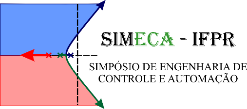

# TÍTULO EM ARIAL 12, CENTRALIZADO, NEGRITO E MAIÚSCULAS: SUBTÍTULO TAMBÉM TODO EM ARIAL 12, NEGRITO E MAIÚSCULAS, SENDO A EXTENSÃO MÁXIMA DO CONJUNTO DE TRÊS LINHAS

**AUTORES:**

1. Nome completo do Autor 1 | 0000-0000-0000-0001 | Instituição do Autor 1 | email.autor1@email.com
2. Nome completo do Autor 2 | 0000-0000-0000-0002 | Instituição do Autor 2 | email.autor2@email.com
3. Nome completo do Autor 3 | 0000-0000-0000-0003 | Instituição do Autor 3 | email.autor3@email.com
4. Nome completo do Autor 4 | 0000-0000-0000-0004 | Instituição do Autor 4 | email.autor4@email.com
5. Nome completo do Autor 5 | 0000-0000-0000-0005 | Instituição do Autor 5 | email.autor5@email.com
6. Nome completo do Autor 6 | 0000-0000-0000-0006 | Instituição do Autor 6 | email.autor6@email.com

**DOI:** https://doi.org/10.5281/zenodo.XXX

## RESUMO

Deve ser elaborado em fonte Arial 11 justificado, em parágrafo único e sem recuo na primeira linha, com espaço entre linhas na opção múltiplos em 1,15. Deve usar o estilo “Resumo” presente no documento. O resumo deve ser um texto completo, apresentando o contexto, os objetivos do trabalho, a metodologia, resultados obtidos e conclusões. Deve conter de 150 a 300 palavras.

**PALAVRAS-CHAVE:** No mínimo 3 (três) e no máximo 5 (cinco) palavras-chave separadas por ponto final.

## 1 INTRODUÇÃO

O artigo deve ser escrito para uma página tamanho padrão A4 no formato retrato. As páginas do artigo deverão ter margens superior e inferior igual a 2,0 cm e as demais margens iguais a 1,0 cm. Serão aceitos apenas artigos inéditos. O número de autores é limitado ao total de 06 (seis) autores. Mantenha os cabeçalhos e rodapés das páginas conforme apresentado no template. Os artigos publicados pelo SIMECA têm seu copyright pelos autores e são licenciados pela licença Creative Commons 4.0.

O texto do artigo deve conter as seguintes seções: 1. INTRODUÇÃO, 2. FUNDAMENTAÇÃO TEÓRICA, 3. METODOLOGIA, 4. RESULTADOS E DISCUSSÕES, 5. CONSIDERAÇÕES FINAIS e REFERÊNCIAS. Os títulos 2. FUNDAMENTAÇÃO TEÓRICA e 3. METODOLOGIA poderão ser alterados conforme a necessidade dos autores. Os títulos das seções devem estar em fonte Arial, tamanho 11, negrito e alinhado à esquerda. O espaçamento entre linhas deve estar na opção múltiplos em 1,15. Deixar um espaçamento de 10pt antes e depois dos títulos das seções. Utilize o estilo “1. Título 1” para o título das seções. As seções devem ser numeradas, com exceção dos títulos “REFERÊNCIAS”, “AGRADECIMENTOS”, “FINANCIAMENTO”, “DECLARAÇÃO DE USO DE INTELIGÊNCIA ARTIFICIAL GENERATIVA” e “CONFLITO DE INTERESSES”. Estas seções também são obrigatórias. Caso seja necessário subdivisões nas seções, elas devem apresentar o número da seção e, em seguida, o número da subdivisão e seu nome em letras maiúsculas sem negrito. Por exemplo: “3.1 MATERIAIS UTILIZADOS” e “3.2 CONSTRUÇÃO DO PROTÓTIPO”. Utilize o estilo “1.1 Título 2” presente na galeria de estilos para o título dessas subdivisões. Seções terciárias também são possíveis, utilize o estilo “1.1.1 Título 3” neste caso.

No corpo do texto o espaçamento entre linhas será na opção múltiplos com valor de 1,15, fonte Arial 11, o parágrafo será justificado, sem recuo na primeira linha. Deixar um espaço de 10pt após cada parágrafo. Para facilitar a formatação, escolha o estilo “Normal; Texto” na galeria de estilos. O ARTIGO DEVERÁ TER DE 4 A 10 LAUDAS.

A introdução deve conter revisão da literatura pertinente ao trabalho, destacando e comparando os principais resultados já apresentados na área com os resultados obtidos no trabalho. Ela também deve apresentar as linhas gerais que serão desenvolvidas no corpo do artigo. A Introdução deverá conter o(s) objetivo(s) do estudo apresentado e uma visão geral sobre a metodologia, resultados encontrados e conclusões.

### 1.1 Identificação

Os nomes completos dos autores devem ser posicionados nas células da tabela ao lado esquerdo do resumo, em fonte Arial, negrito, tamanho 11, alinhamento à esquerda, sem recuo de parágrafo. Cada nome em uma linha, apenas com as iniciais maiúsculas. O sobrenome final de cada autor(a) deverá ser seguido por um espaço e então de um número sequencial em algarismos arábicos entre colchetes, conforme exemplo: Mônica Bernardo Neves [1]. No início da linha correspondente a cada autor deve ser incluído o ícone do ORCID no qual deve ser inserido o link para o ORCID correspondente ao autor. Clique na imagem com o botão direito do mouse e escolha a opção link e então cole o endereço perfil do ORCID do autor. O ORCID pode ser criado gratuitamente acessando o endereço https://orcid.org/register. É obrigatório que todos os autores possuam ORCID e que o link esteja corretamente informado.

A instituição e endereço de correio eletrônico deverão ser descritos abaixo da lista dos autores, em fonte Arial, tamanho 10, alinhamento à esquerda, sem recuo de parágrafo, espaçamento entre linhas na opção múltiplos em 1,15. No início da linha deve ser inserido entre colchetes o número correspondente ao autor. Esse número entre colchetes não deve ser sobrescrito. Os dados são obrigatórios e condicionantes para submissão do artigo.

Abaixo da instituição, deixar o ícone do DOI e indicação de endereço conforme template. Este endereço será atualizado após a definição do DOI do artigo.

## 2 FUNDAMENTAÇÃO TEÓRICA

Nesta seção os autores deverão detalhar o estado da arte sobre o problema e apresentar a teoria utilizada como base para o desenvolvimento do trabalho.

Citações e referências devem seguir o modelo ABNT no formato autor-ano. Existem dois tipos de citações possíveis no texto: a narrativa e a entre parênteses. A citação entre parênteses deve incluir o sobrenome do(s) autor(es) entre parênteses, com iniciais maiúsculas, seguidos por vírgula e o ano de publicação da obra citada. A citação narrativa inclui o sobrenome do(s) autor(es) como parte da sentença seguida pelo ano de publicação da obra entre parênteses. A expressão “et al.” deve ser utilizada quando o trabalho possuir mais que três autores. Ela deve estar em itálico. Observe que não deve haver ponto final após “et”.

Na seção REFERÊNCIAS todas as obras citadas devem estar listadas em ordem alfabética. Um exemplo de livro citado em frase é Ogata (2010). Trabalhos como TCCs ou Teses também podem ser citados (Abreu, 2008; Nogueira, 2016), sendo que quando mais de uma obra é citada entre parênteses, um ponto e vírgula deve ser usado como separador. Um exemplo de citação de artigo de revista é Alves et al. (2022), na qual o número de autores maior do que três deve ser substituído por et al. na citação, mas a lista de referências deve conter todos os nomes dos autores. Citação de páginas da web também são possíveis (Naylamp Mecatronics, 2016), porém os autores devem se atentar para a credibilidade da página citada. Por fim, trabalhos publicados em anais de eventos podem ser citados como em Yamanaka et al. (2022). Citações diretas, na qual a referência é simplesmente copiada para o texto do trabalho são possíveis, mas desencorajadas, e o autor deve consultar a norma da ABNT para obter instruções de como realizá-la. Quando há uma citação no final da frase, o ponto final deve aparecer apenas depois da citação.

Caso seja necessário incluir equações, elas devem ter alinhamento centralizado e ser inseridas em ambiente matemático (Aba Inserir e então Equação, no MS Word, ou alt++). As equações que forem citadas no texto deverão numeradas à direita, com numeração entre parênteses. Um exemplo de equação é mostrado em (1).

$$u(t) = K_p e(t) + K_i \int_0^t e(t) dt + K_d \frac{de(t)}{dt} . \tag{1}$$

## 3 METODOLOGIA

Na METODOLOGIA será explicitado o tipo de estudo, local, população (caso for pesquisa de campo), período, técnica e análise dos dados, bem como as normas éticas seguidas que foram utilizadas no caso da pesquisa ser com seres humanos, enfim todos os métodos utilizados para a realização do trabalho.

## 4 RESULTADOS E DISCUSSÕES

Nesta seção os autores devem apresentar, interpretar e discutir os dados coletados na pesquisa.

As legendas de figuras devem aparecer abaixo do elemento, centralizada e em fonte Arial, tamanho 10. Utilize o estilo “Legenda” da galeria de estilos. As figuras devem ser centralizadas e em parágrafos sem deslocamento na primeira linha. Os autores devem se atentar para a definição das figuras (recomenda-se pelo menos 300 dpi ou no formato Elementos Gráficos Vetoriais Escaláveis .svg). Um exemplo é mostrado na Figura 1. Todas as figuras devem ser citadas no texto pelo seu número, que consta na legenda. NÃO SEPARAR A LEGENDA E A FIGURA correspondente em páginas diferentes do artigo.

É possível utilizar figuras ou tabelas com largura maior que uma coluna. Veja exemplo na Figura 2. Para inserir este tipo de Figura/Tabela, é preciso inserir quebras de seção antes e depois do elemento. Entre as quebras escolha a opção uma coluna. A legenda do elemento deve ficar na mesma configuração de colunas que a Figura/Tabela. As opções de quebra de seção e escolha do número de colunas encontram-se na aba Layout do MS Word.

As tabelas devem estar centralizadas na página e em parágrafos sem deslocamento na primeira linha. As legendas de tabelas devem aparecer acima do elemento, centralizada e em fonte Arial, tamanho 10. Utilize o estilo “Legenda” da galeria de estilos. Todas as tabelas presentes no trabalho devem ser citadas no texto por seu número e serem discutidas no texto.

Tabela 1 - Características construtivas do protótipo (Yamanaka et al., 2022).

| Símbolo | Descrição | Valor |
| --- | --- | --- |
| $L_1$ | Haste do pêndulo | 205 mm |
| $L_2$ | Haste do contrapeso | 190 mm |
| $L_{cp}$ | Comprimento do contrapeso | 70 mm |
| $m_{cp}$ | Massa do contrapeso | 57,33 g |
| $m_p$ | Massa do conjunto do pêndulo | 118,27 g |

Um exemplo de tabela é apresentado na Tabela 1. NÃO SEPARAR A LEGENDA E A TABELA, por exemplo, o título da tabela ou da figura é apresentado em uma página, enquanto a tabela ou a figura correspondente aparece na página seguinte. Evitar que tabelas sejam “quebradas”, ou seja, que comecem com algumas linhas em uma página e termine na página seguinte.

## 5 CONSIDERAÇÕES FINAIS

Favor seguir as normas de diagramação aqui expostas, usando este exemplo como base para o seu texto. A submissão do artigo significa que os autores concordam com a publicação deste, a critério da Comissão Editorial, em meio digital. Além disso, os autores concordam que pela publicação do artigo não obterão nenhum ganho, senão a divulgação científica e profissional dos seus trabalhos. Os artigos publicados no SIMECA estão licenciados pela licença Creative Commons CC BY 4.0

No guia para autores do evento (https://sites.google.com/ifpr.edu.br/simeca-ifpr/guia-para-autores), é possível obter informações sobre o fluxo de submissão dos trabalhos no evento e sobre.

os critérios de triagem e revisão dos artigos submetidos. Aconselha-se que os autores se atentem a esses critérios durante a elaboração de seu manuscrito

As considerações finais deverão apresentar os resultados do artigo e conectá-los aos objetivos do trabalho, que devem estar na seção de introdução. Ela também pode apresentar sugestão de trabalhos futuros.

## AGRADECIMENTOS

Mencionar as instituições ou programas de fomento que forneceram suporte ao desenvolvimento do trabalho.

## FINANCIAMENTO

Elencar as agências de fomento que financiaram o trabalho reportado no artigo, por exemplo, "Este estudo contou com apoio financeiro do Conselho Nacional de Desenvolvimento Científico e Tecnológico (CNPq), Brasil, Bolsa nº xxxxxx/yyyy ". Caso não haja financiamento, escrever algo como “Esta pesquisa não recebeu financiamento externo específico para o seu desenvolvimento”.

## DECLARAÇÃO DE USO DE INTELIGÊNCIA ARTIFICIAL GENERATIVA

A Portaria CNPq nº 2.664, de 6 de março de 2026 (Política de Integridade na Atividade Científica), o Art. 9º, inciso I, alíneas "c" a "f", estabelece que pesquisadores devem:

- Declarar o uso de ferramentas de Inteligência Artificial Generativa (IAG) de qualquer espécie e em qualquer fase da pesquisa (concepção, redação, análise de dados, submissão);
- Especificar a ferramenta utilizada e a finalidade;
- Assumir responsabilidade integral pelo conteúdo final, inclusive por plágios ou imprecisões geradas pela IAG;
- Não submeter conteúdo gerado por IAG como se fosse de autoria humana.

Nesta seção do artigo os autores devem declarar o uso de IAG. Exemplos de declarações são:

“Declaramos que a ferramenta [nome e versão, ex.: ChatGPT, OpenAI, GPT-4o] foi utilizada como apoio nas fases de concepção e redação desta pesquisa, com as seguintes finalidades: (i) mapeamento preliminar da literatura e sugestão de referências bibliográficas, posteriormente verificadas pelos autores nas bases originais; e (ii) revisão gramatical e aprimoramento estilístico de trechos previamente escritos pelos autores. A ferramenta não foi empregada na formulação de hipóteses, na análise de dados nem na geração de conteúdo conceitual original. Os autores revisaram integralmente todas as sugestões e assumem responsabilidade plena pelo conteúdo final do manuscrito.”

“Os autores informam que a ferramenta [nome e versão] foi utilizada como apoio à busca e organização de referências bibliográficas, todas verificadas nas fontes originais, e à revisão linguística do texto. Nenhum conteúdo conceitual, dado ou resultado foi gerado por IAG. A responsabilidade integral pelo conteúdo final é dos autores.”

## CONFLITO DE INTERESSES

Declarar todos os conflitos de interesse presentes no desenvolvimento do trabalho e na publicação. Se não houver, escrever algo como “Os autores declaram não haver conflito de interesses no desenvolvimento e na publicação deste trabalho”.

## REFERÊNCIAS

Todas as obras citadas no texto devem ser referenciadas. Cada tipo de material, livro, capítulo de livro, artigo de revista impressa, artigo de revista online, reportagem de sites, trabalhos de conclusão, dissertações, anais de congressos, entre outros, são referenciados de formas diferentes. A listagem das referências deve estar em fonte Arial tamanho 11, alinhadas à esquerda, e com espaços simples entre linhas. Deve ser deixado um espaçamento após de 10pt. Utilize a opção de estilo “Referências” para a listagem das obras. Não suprimir os nomes dos autores na listagem das referências.
As citações e referências devem seguir as normas:
ASSOCIAÇÃO BRASILEIRA DE NORMAS TÉCNICAS. ABNT NBR 10520: Informação e documentação - Citações em documentos - Apresentação. Rio de Janeiro: ABNT, 2023.
ABNT. ABNT NBR10520: informação e documentação: citação em documentos: apresentação Rio de Janeiro, 2002.
No caso de dúvidas, consultar o Manual de normas ABNT do IFPR, Seções 3.3 e 3.4.1.
SOBRENOME, Nome. Título da obra em negrito: subtítulo sem negrito (se houver). Cidade: Editora, Ano.
ABREU, I. S. Controle Inteligente LQR Neuro-Genético para Alocação de Autoestrutura em Sistemas Dinâmicos Multivariáveis. 2008. Tese (Doutorado em Engenharia Elétrica), Universidade Federal do Pará, Belém, 2008.
ALVES, U. N. L. T.; BREGANON, Ricardo; PIVOVAR, L. E.; ALMEIDA, J. P. L. S.; BARBARA, G. V.; MENDONCA, M.; PALACIOS, R. H. C. Discrete-time $H_\infty$ integral control via LMIs applied to a Furuta pendulum. Journal of Control, Automation and Electrical Systems, Springer, v. 33, n. 3, p. 1-12, 2022.
NAYLAMP MECATRONICS. Tutorial MPU6050, Acelerómetro y Giroscopio, 2016. Disponível em: https://naylampmechatronics.com/blog/45_tutorial-mpu6050-acelerometro-y-giroscopio.html. Acessado em: 10/10/2022.
NOGUEIRA, L. G. M. Projeto de Controle via LMIs Considerando Saturação no Atuador para uma Suspensão Ativa de Bancada. 80 f. Trabalho de Conclusão de Curso (TCC), Universidade Estadual Paulista “Júlio de Mesquita Filho”, UNESP, Ilha Solteira, 2016.
OGATA, K. Engenharia de Controle Moderno. 5 ed. São Paulo: Pearson, 2010.
YAMANAKA, Hugo F.; BISPO, Carlos A. S.; BREGANON, Ricardo; RIBEIRO, Fernando S. F.; ALMEIDA, João P. L. S.; ALVES, Uiliam N. L. T. Construção e Controle Seguidor via LQR de um Sistema Aeropêndulo. Anais do XXIV Congresso Brasileiro de Automática. Fortaleza, CE: Sociedade Brasileira Automática, SBA, 2022.
Em caso de dúvida, deve-se seguir as normas atualizadas da ABNT.
